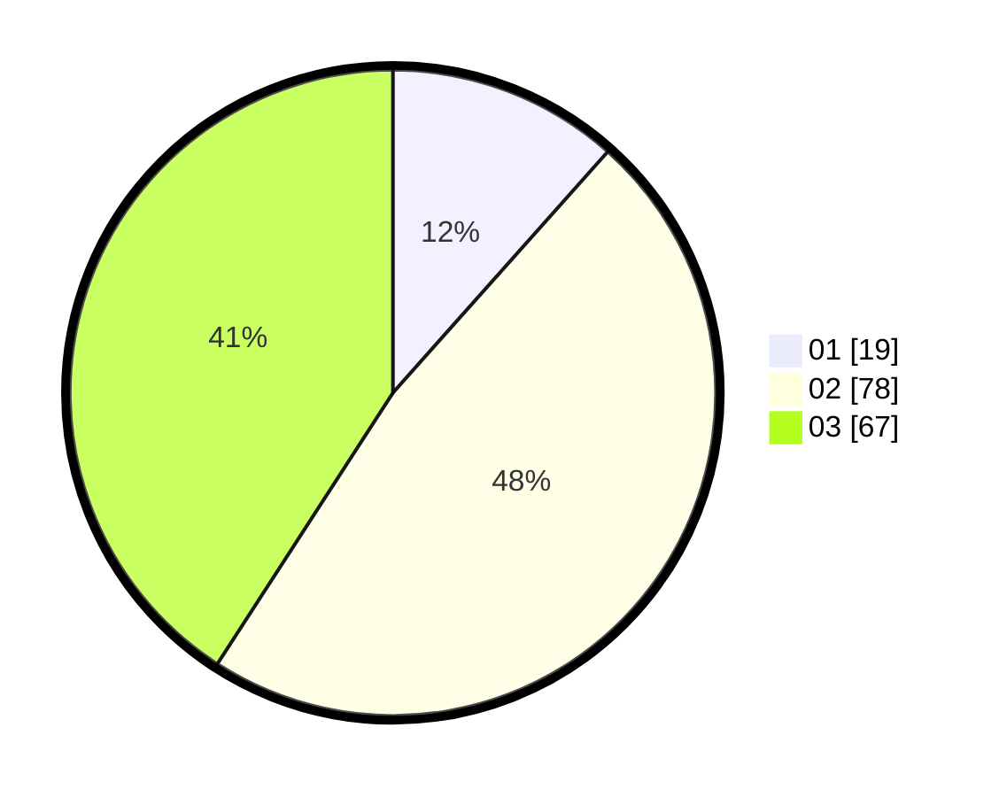

# Hasil

Hasil perolehan suara paslon dapat dilihat pada file paslon-01.txt, paslon-02.txt, dan paslon-03.txt.

Jika tidak ada, artinya data tersebut belum ada pada SIREKAP.

## Perolehan Suara

 * Paslon 01: **19**.
 * Paslon 02: **78**.
 * Paslon 03: **67**.

## Foto C Plano

https://sirekap-obj-formc.kpu.go.id/d55b/pemilu/ppwp/31/73/04/10/09/3173041009081-20240214-234223--d631f877-0014-487c-947b-8eb248d6348e.jpg

https://sirekap-obj-formc.kpu.go.id/d55b/pemilu/ppwp/31/73/04/10/09/3173041009081-20240214-155926--f29981b4-01b8-4d41-b6a0-7d7d6750ceef.jpg

https://sirekap-obj-formc.kpu.go.id/d55b/pemilu/ppwp/31/73/04/10/09/3173041009081-20240214-194942--0d9ac751-ed09-4885-9225-f1b5ee5fc514.jpg
