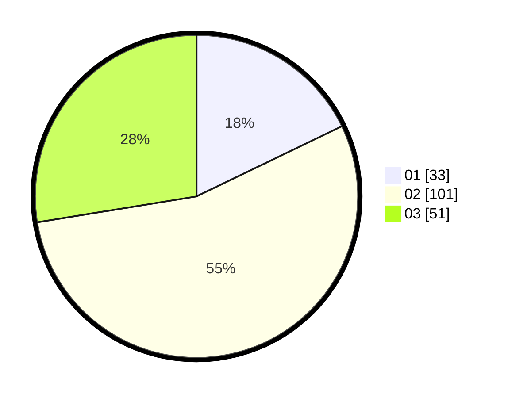

# Hasil

Hasil perolehan suara paslon dapat dilihat pada file paslon-01.txt, paslon-02.txt, dan paslon-03.txt.

Jika tidak ada, artinya data tersebut belum ada pada SIREKAP.

## Perolehan Suara

 * Paslon 01: **33**.
 * Paslon 02: **101**.
 * Paslon 03: **51**.

## Foto C Plano

https://sirekap-obj-formc.kpu.go.id/d48f/pemilu/ppwp/31/73/04/10/09/3173041009082-20240215-023118--d47e6b13-8f41-4cb4-8842-0e1a5c124c25.jpg

https://sirekap-obj-formc.kpu.go.id/d48f/pemilu/ppwp/31/73/04/10/09/3173041009082-20240215-023449--6c685f25-7547-48d6-b062-b203e8ca4c1f.jpg

https://sirekap-obj-formc.kpu.go.id/d48f/pemilu/ppwp/31/73/04/10/09/3173041009082-20240215-024023--8dd78dd4-a24a-453e-a12b-41789092aaa7.jpg
