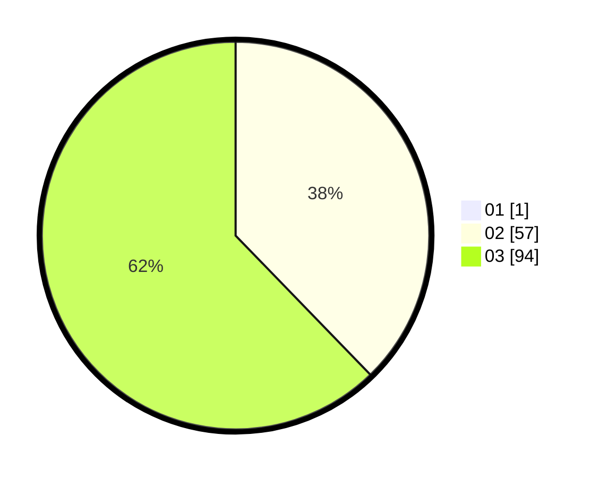

# Hasil

Hasil perolehan suara paslon dapat dilihat pada file paslon-01.txt, paslon-02.txt, dan paslon-03.txt.

Jika tidak ada, artinya data tersebut belum ada pada SIREKAP.

## Perolehan Suara

 * Paslon 01: **1**.
 * Paslon 02: **57**.
 * Paslon 03: **94**.

## Foto C Plano

https://sirekap-obj-formc.kpu.go.id/b3b1/pemilu/ppwp/31/73/04/10/10/3173041010003-20240215-224433--69fd8407-b23f-4321-af91-56e203c4d151.jpg

https://sirekap-obj-formc.kpu.go.id/b3b1/pemilu/ppwp/31/73/04/10/10/3173041010003-20240215-224437--9fd12905-03f0-476c-ab32-d74a7873e601.jpg

https://sirekap-obj-formc.kpu.go.id/b3b1/pemilu/ppwp/31/73/04/10/10/3173041010003-20240215-224435--63108760-0f3a-40ec-a999-d854b3db37a3.jpg

## DATA PEMILIH TETAP

Jumlah pemilih dalam DPT: **221**.
 * L: **103**.
 * P: **118**.

## DATA PENGGUNA HAK PILIH

Jumlah pengguna hak pilih dalam DPT: **150**.
 * L: **74**.
 * P: **76**.

Jumlah pengguna hak pilih dalam DPTb: **5**.
 * L: **3**.
 * P: **2**.

Jumlah pengguna hak pilih dalam DPK: **1**.
 * L: **1**.
 * P: **0**.

Jumlah pengguna hak pilih: **156**.
 * L: **78**.
 * P: **78**.

## JUMLAH SUARA SAH DAN TIDAK SAH

JUMLAH SELURUH SUARA SAH: **152**.

JUMLAH SUARA TIDAK SAH: **4**.

JUMLAH SELURUH SUARA SAH DAN SUARA TIDAK SAH: **156**.
