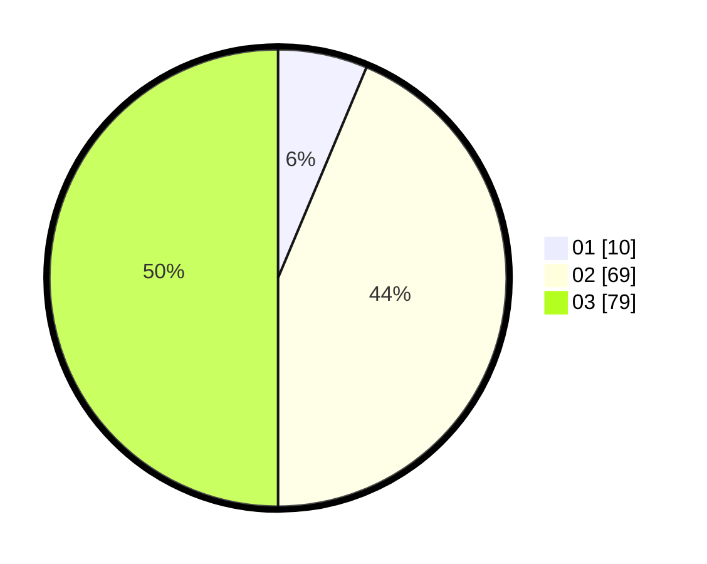

# Hasil

Hasil perolehan suara paslon dapat dilihat pada file paslon-01.txt, paslon-02.txt, dan paslon-03.txt.

Jika tidak ada, artinya data tersebut belum ada pada SIREKAP.

## Perolehan Suara

 * Paslon 01: **10**.
 * Paslon 02: **69**.
 * Paslon 03: **79**.

## Foto C Plano

https://sirekap-obj-formc.kpu.go.id/b442/pemilu/ppwp/31/73/04/10/10/3173041010004-20240216-012611--49c0c597-071a-42a3-a13c-42355a4f1ce6.jpg

https://sirekap-obj-formc.kpu.go.id/b442/pemilu/ppwp/31/73/04/10/10/3173041010004-20240216-012612--828cdb25-247e-47ec-88ba-3b2e34b94ac0.jpg

https://sirekap-obj-formc.kpu.go.id/b442/pemilu/ppwp/31/73/04/10/10/3173041010004-20240216-012612--dd84c746-0856-4291-b6a3-1f181c3e9672.jpg

## DATA PEMILIH TETAP

Jumlah pemilih dalam DPT: **218**.
 * L: **96**.
 * P: **122**.

## DATA PENGGUNA HAK PILIH

Jumlah pengguna hak pilih dalam DPT: **153**.
 * L: **69**.
 * P: **84**.

Jumlah pengguna hak pilih dalam DPTb: **5**.
 * L: **4**.
 * P: **1**.

Jumlah pengguna hak pilih dalam DPK: **5**.
 * L: **1**.
 * P: **4**.

Jumlah pengguna hak pilih: **163**.
 * L: **74**.
 * P: **89**.

## JUMLAH SUARA SAH DAN TIDAK SAH

JUMLAH SELURUH SUARA SAH: **158**.

JUMLAH SUARA TIDAK SAH: **5**.

JUMLAH SELURUH SUARA SAH DAN SUARA TIDAK SAH: **163**.
