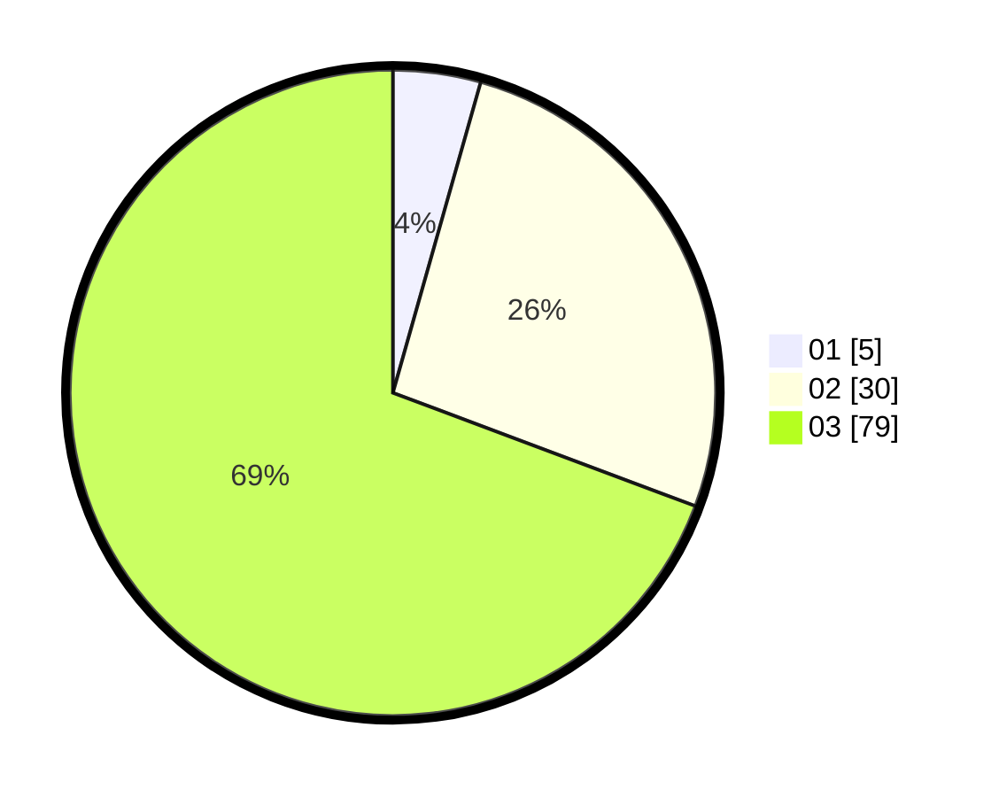

# Hasil

Hasil perolehan suara paslon dapat dilihat pada file paslon-01.txt, paslon-02.txt, dan paslon-03.txt.

Jika tidak ada, artinya data tersebut belum ada pada SIREKAP.

## Perolehan Suara

 * Paslon 01: **5**.
 * Paslon 02: **30**.
 * Paslon 03: **79**.

## Foto C Plano

https://sirekap-obj-formc.kpu.go.id/b533/pemilu/ppwp/31/73/04/10/10/3173041010005-20240215-234336--c1575804-d2a4-4985-bb1e-8b7f4d2dc267.jpg

https://sirekap-obj-formc.kpu.go.id/b533/pemilu/ppwp/31/73/04/10/10/3173041010005-20240215-234339--70dad8bf-b5f6-44bb-b2af-86727abd9d8c.jpg

https://sirekap-obj-formc.kpu.go.id/b533/pemilu/ppwp/31/73/04/10/10/3173041010005-20240215-234338--a0b7f30c-0fbe-4ae8-91ad-e24513cd7037.jpg

## DATA PEMILIH TETAP

Jumlah pemilih dalam DPT: **183**.
 * L: **95**.
 * P: **88**.

## DATA PENGGUNA HAK PILIH

Jumlah pengguna hak pilih dalam DPT: **110**.
 * L: **58**.
 * P: **52**.

Jumlah pengguna hak pilih dalam DPTb: **4**.
 * L: **1**.
 * P: **3**.

Jumlah pengguna hak pilih dalam DPK: **2**.
 * L: **2**.
 * P: **0**.

Jumlah pengguna hak pilih: **116**.
 * L: **61**.
 * P: **55**.

## JUMLAH SUARA SAH DAN TIDAK SAH

JUMLAH SELURUH SUARA SAH: **114**.

JUMLAH SUARA TIDAK SAH: **2**.

JUMLAH SELURUH SUARA SAH DAN SUARA TIDAK SAH: **116**.
