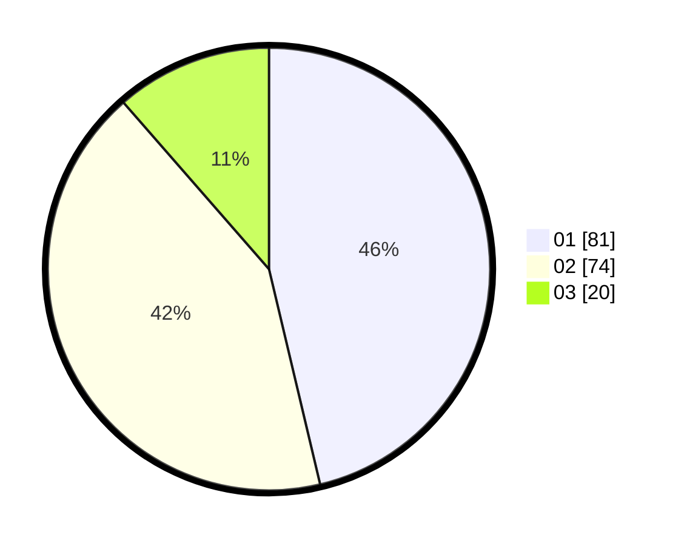

# Hasil

Hasil perolehan suara paslon dapat dilihat pada file paslon-01.txt, paslon-02.txt, dan paslon-03.txt.

Jika tidak ada, artinya data tersebut belum ada pada SIREKAP.

## Perolehan Suara

 * Paslon 01: **81**.
 * Paslon 02: **74**.
 * Paslon 03: **20**.

## Foto C Plano

https://sirekap-obj-formc.kpu.go.id/7c73/pemilu/ppwp/31/73/04/10/10/3173041010008-20240216-051331--ce147519-2ddb-4b4f-8a21-31c9de301307.jpg

https://sirekap-obj-formc.kpu.go.id/7c73/pemilu/ppwp/31/73/04/10/10/3173041010008-20240216-051333--7f64e9b9-547f-462c-9932-26580e041008.jpg

https://sirekap-obj-formc.kpu.go.id/7c73/pemilu/ppwp/31/73/04/10/10/3173041010008-20240216-051332--dbf9710a-3cf4-4392-b068-7fe3cd544a73.jpg

## DATA PEMILIH TETAP

Jumlah pemilih dalam DPT: **248**.
 * L: **127**.
 * P: **121**.

## DATA PENGGUNA HAK PILIH

Jumlah pengguna hak pilih dalam DPT: **171**.
 * L: **82**.
 * P: **89**.

Jumlah pengguna hak pilih dalam DPTb: **6**.
 * L: **4**.
 * P: **2**.

Jumlah pengguna hak pilih dalam DPK: **0**.
 * L: **0**.
 * P: **0**.

Jumlah pengguna hak pilih: **177**.
 * L: **86**.
 * P: **91**.

## JUMLAH SUARA SAH DAN TIDAK SAH

JUMLAH SELURUH SUARA SAH: **175**.

JUMLAH SUARA TIDAK SAH: **2**.

JUMLAH SELURUH SUARA SAH DAN SUARA TIDAK SAH: **177**.
