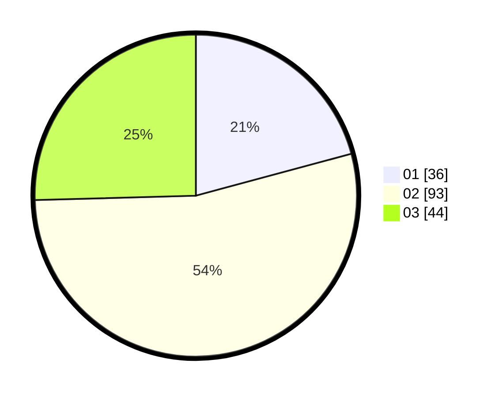

# Hasil

Hasil perolehan suara paslon dapat dilihat pada file paslon-01.txt, paslon-02.txt, dan paslon-03.txt.

Jika tidak ada, artinya data tersebut belum ada pada SIREKAP.

## Perolehan Suara

 * Paslon 01: **36**.
 * Paslon 02: **93**.
 * Paslon 03: **44**.

## Foto C Plano

https://sirekap-obj-formc.kpu.go.id/09c1/pemilu/ppwp/31/73/04/10/10/3173041010009-20240216-052158--7399c60a-130d-4564-9d40-a47caf9a7af2.jpg

https://sirekap-obj-formc.kpu.go.id/09c1/pemilu/ppwp/31/73/04/10/10/3173041010009-20240216-051103--29db1c69-cb80-4525-98ed-4e1813c5fabd.jpg

https://sirekap-obj-formc.kpu.go.id/09c1/pemilu/ppwp/31/73/04/10/10/3173041010009-20240216-051055--e94c761b-f376-4d2b-9fd8-0471a04aff10.jpg

## DATA PEMILIH TETAP

Jumlah pemilih dalam DPT: **241**.
 * L: **114**.
 * P: **127**.

## DATA PENGGUNA HAK PILIH

Jumlah pengguna hak pilih dalam DPT: **181**.
 * L: **78**.
 * P: **103**.

Jumlah pengguna hak pilih dalam DPTb: **4**.
 * L: **2**.
 * P: **2**.

Jumlah pengguna hak pilih dalam DPK: **0**.
 * L: **0**.
 * P: **0**.

Jumlah pengguna hak pilih: **185**.
 * L: **80**.
 * P: **105**.

## JUMLAH SUARA SAH DAN TIDAK SAH

JUMLAH SELURUH SUARA SAH: **173**.

JUMLAH SUARA TIDAK SAH: **12**.

JUMLAH SELURUH SUARA SAH DAN SUARA TIDAK SAH: **185**.
