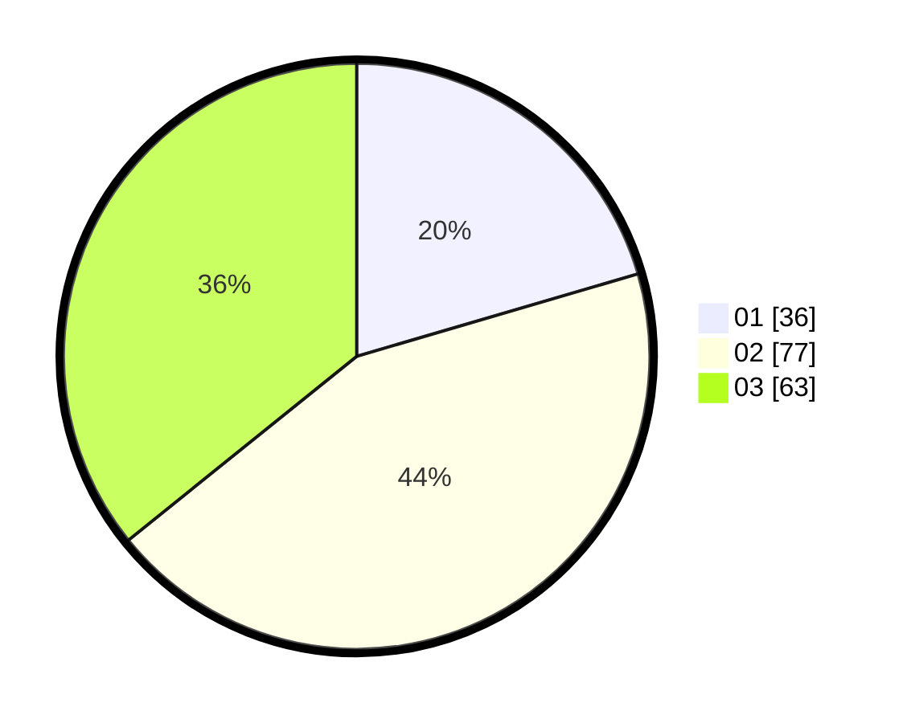

# Hasil

Hasil perolehan suara paslon dapat dilihat pada file paslon-01.txt, paslon-02.txt, dan paslon-03.txt.

Jika tidak ada, artinya data tersebut belum ada pada SIREKAP.

## Perolehan Suara

 * Paslon 01: **36**.
 * Paslon 02: **77**.
 * Paslon 03: **63**.

## Foto C Plano

https://sirekap-obj-formc.kpu.go.id/5f3f/pemilu/ppwp/31/73/04/10/10/3173041010010-20240215-212040--e9bd327b-8f48-4eeb-aa06-5c55e1edeca8.jpg

https://sirekap-obj-formc.kpu.go.id/5f3f/pemilu/ppwp/31/73/04/10/10/3173041010010-20240215-212044--57c13bcd-3f43-4d0c-9a7a-5ffa6d5f952d.jpg

https://sirekap-obj-formc.kpu.go.id/5f3f/pemilu/ppwp/31/73/04/10/10/3173041010010-20240215-212042--a26b91b3-7da6-4188-94e9-863266486dcc.jpg

## DATA PEMILIH TETAP

Jumlah pemilih dalam DPT: **241**.
 * L: **120**.
 * P: **121**.

## DATA PENGGUNA HAK PILIH

Jumlah pengguna hak pilih dalam DPT: **178**.
 * L: **90**.
 * P: **88**.

Jumlah pengguna hak pilih dalam DPTb: **5**.
 * L: **2**.
 * P: **3**.

Jumlah pengguna hak pilih dalam DPK: **0**.
 * L: **0**.
 * P: **0**.

Jumlah pengguna hak pilih: **183**.
 * L: **92**.
 * P: **91**.

## JUMLAH SUARA SAH DAN TIDAK SAH

JUMLAH SELURUH SUARA SAH: **176**.

JUMLAH SUARA TIDAK SAH: **7**.

JUMLAH SELURUH SUARA SAH DAN SUARA TIDAK SAH: **183**.
