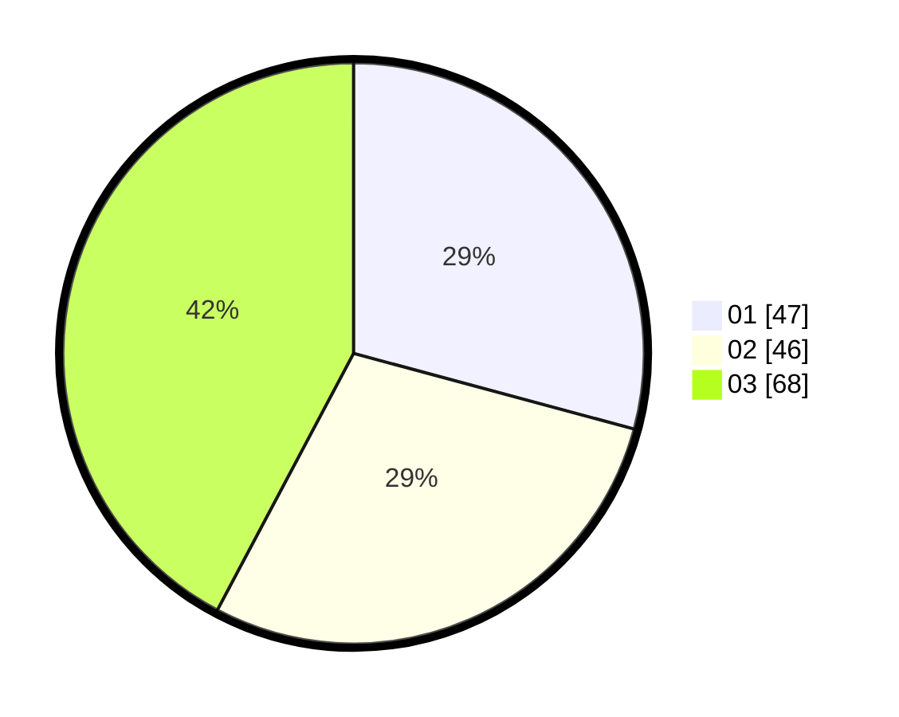

# Hasil

Hasil perolehan suara paslon dapat dilihat pada file paslon-01.txt, paslon-02.txt, dan paslon-03.txt.

Jika tidak ada, artinya data tersebut belum ada pada SIREKAP.

## Perolehan Suara

 * Paslon 01: **47**.
 * Paslon 02: **46**.
 * Paslon 03: **68**.

## Foto C Plano

https://sirekap-obj-formc.kpu.go.id/9d0a/pemilu/ppwp/31/73/04/10/10/3173041010013-20240216-131243--b540041e-a1e4-4e2f-adf0-31a9d67dc9a6.jpg

https://sirekap-obj-formc.kpu.go.id/9d0a/pemilu/ppwp/31/73/04/10/10/3173041010013-20240216-131245--e6d33a89-41ce-48d9-b916-359a01d9f556.jpg

https://sirekap-obj-formc.kpu.go.id/9d0a/pemilu/ppwp/31/73/04/10/10/3173041010013-20240216-131244--4ee9d478-459a-4bae-a6f4-ac9f1e43b71e.jpg

## DATA PEMILIH TETAP

Jumlah pemilih dalam DPT: **241**.
 * L: **124**.
 * P: **117**.

## DATA PENGGUNA HAK PILIH

Jumlah pengguna hak pilih dalam DPT: **164**.
 * L: **84**.
 * P: **80**.

Jumlah pengguna hak pilih dalam DPTb: **6**.
 * L: **0**.
 * P: **6**.

Jumlah pengguna hak pilih dalam DPK: **0**.
 * L: **0**.
 * P: **0**.

Jumlah pengguna hak pilih: **170**.
 * L: **84**.
 * P: **86**.

## JUMLAH SUARA SAH DAN TIDAK SAH

JUMLAH SELURUH SUARA SAH: **161**.

JUMLAH SUARA TIDAK SAH: **9**.

JUMLAH SELURUH SUARA SAH DAN SUARA TIDAK SAH: **170**.
