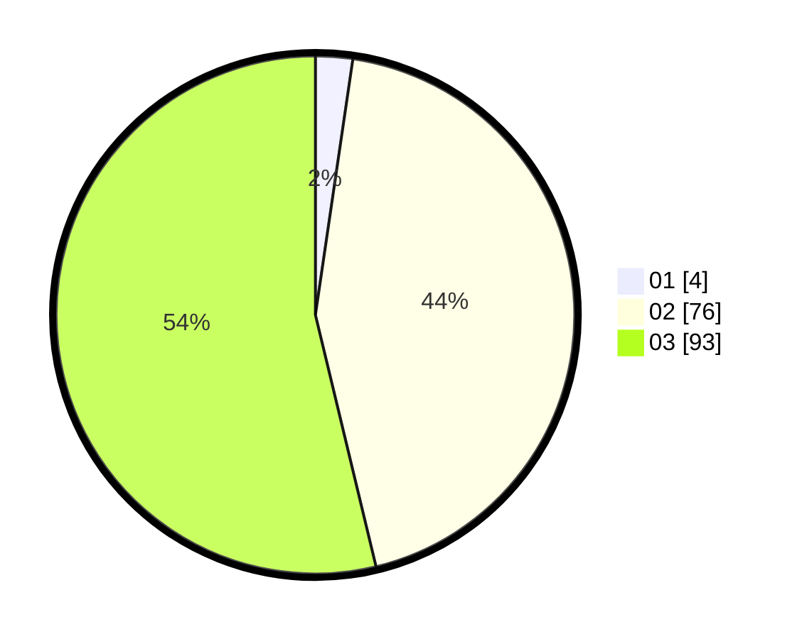

# Hasil

Hasil perolehan suara paslon dapat dilihat pada file paslon-01.txt, paslon-02.txt, dan paslon-03.txt.

Jika tidak ada, artinya data tersebut belum ada pada SIREKAP.

## Perolehan Suara

 * Paslon 01: **4**.
 * Paslon 02: **76**.
 * Paslon 03: **93**.

## Foto C Plano

https://sirekap-obj-formc.kpu.go.id/b28a/pemilu/ppwp/31/73/04/10/11/3173041011001-20240214-155146--e8bcb1a5-8881-43f1-8a95-5a53d81099e3.jpg

https://sirekap-obj-formc.kpu.go.id/b28a/pemilu/ppwp/31/73/04/10/11/3173041011001-20240214-155901--4f24aaa4-5824-45a2-a426-8face4740ef1.jpg

https://sirekap-obj-formc.kpu.go.id/b28a/pemilu/ppwp/31/73/04/10/11/3173041011001-20240214-162230--3fecf0c5-ddfe-47e8-ad46-780d205baa34.jpg

## DATA PEMILIH TETAP

Jumlah pemilih dalam DPT: **255**.
 * L: **119**.
 * P: **136**.

## DATA PENGGUNA HAK PILIH

Jumlah pengguna hak pilih dalam DPT: **175**.
 * L: **79**.
 * P: **96**.

Jumlah pengguna hak pilih dalam DPTb: **0**.
 * L: **0**.
 * P: **0**.

Jumlah pengguna hak pilih dalam DPK: **1**.
 * L: **0**.
 * P: **1**.

Jumlah pengguna hak pilih: **176**.
 * L: **79**.
 * P: **97**.

## JUMLAH SUARA SAH DAN TIDAK SAH

JUMLAH SELURUH SUARA SAH: **173**.

JUMLAH SUARA TIDAK SAH: **3**.

JUMLAH SELURUH SUARA SAH DAN SUARA TIDAK SAH: **176**.
