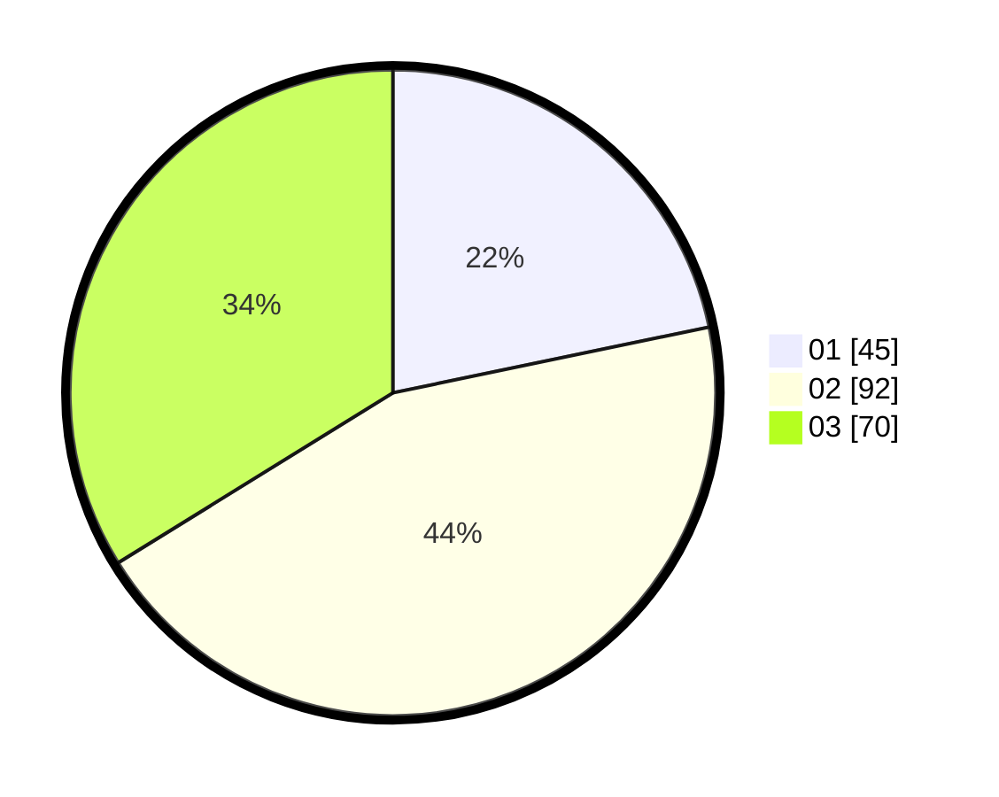

# Hasil

Hasil perolehan suara paslon dapat dilihat pada file paslon-01.txt, paslon-02.txt, dan paslon-03.txt.

Jika tidak ada, artinya data tersebut belum ada pada SIREKAP.

## Perolehan Suara

 * Paslon 01: **45**.
 * Paslon 02: **92**.
 * Paslon 03: **70**.

## Foto C Plano

https://sirekap-obj-formc.kpu.go.id/8c1a/pemilu/ppwp/31/73/04/10/11/3173041011003-20240215-130457--95eca460-e0f1-4bd0-8415-62b4bced6afe.jpg

https://sirekap-obj-formc.kpu.go.id/8c1a/pemilu/ppwp/31/73/04/10/11/3173041011003-20240215-130716--73461e08-0ca1-4bc3-b3a6-bd15ab5eb77e.jpg

https://sirekap-obj-formc.kpu.go.id/8c1a/pemilu/ppwp/31/73/04/10/11/3173041011003-20240214-195754--e8edc4a6-1f58-4b38-80b3-5ece14cef3a4.jpg
