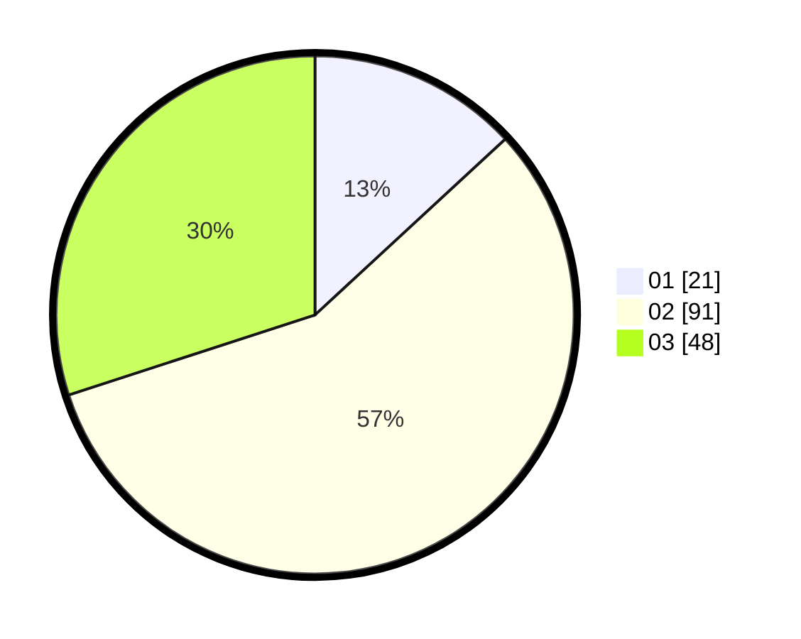

# Hasil

Hasil perolehan suara paslon dapat dilihat pada file paslon-01.txt, paslon-02.txt, dan paslon-03.txt.

Jika tidak ada, artinya data tersebut belum ada pada SIREKAP.

## Perolehan Suara

 * Paslon 01: **21**.
 * Paslon 02: **91**.
 * Paslon 03: **48**.

## Foto C Plano

https://sirekap-obj-formc.kpu.go.id/9803/pemilu/ppwp/31/73/04/10/11/3173041011005-20240214-192015--098bef37-b7a3-4cac-bdef-159a06447df7.jpg

https://sirekap-obj-formc.kpu.go.id/9803/pemilu/ppwp/31/73/04/10/11/3173041011005-20240214-192240--8f469000-3488-4b07-b241-5ad64fd09b3e.jpg

https://sirekap-obj-formc.kpu.go.id/9803/pemilu/ppwp/31/73/04/10/11/3173041011005-20240214-192359--edb57fa7-bf3e-4760-8c27-8ece08cbc28a.jpg

## DATA PEMILIH TETAP

Jumlah pemilih dalam DPT: **268**.
 * L: **124**.
 * P: **144**.

## DATA PENGGUNA HAK PILIH

Jumlah pengguna hak pilih dalam DPT: **161**.
 * L: **76**.
 * P: **85**.

Jumlah pengguna hak pilih dalam DPTb: **0**.
 * L: **0**.
 * P: **0**.

Jumlah pengguna hak pilih dalam DPK: **1**.
 * L: **0**.
 * P: **1**.

Jumlah pengguna hak pilih: **162**.
 * L: **76**.
 * P: **86**.

## JUMLAH SUARA SAH DAN TIDAK SAH

JUMLAH SELURUH SUARA SAH: **160**.

JUMLAH SUARA TIDAK SAH: **2**.

JUMLAH SELURUH SUARA SAH DAN SUARA TIDAK SAH: **162**.
