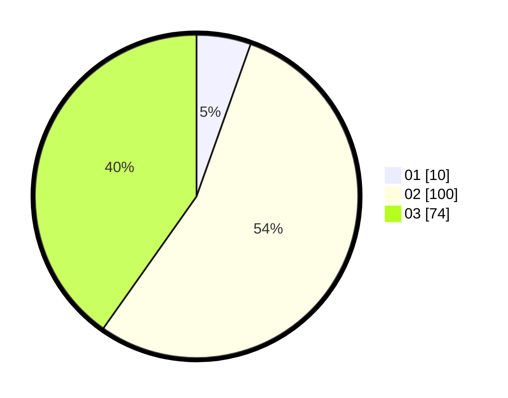

# Hasil

Hasil perolehan suara paslon dapat dilihat pada file paslon-01.txt, paslon-02.txt, dan paslon-03.txt.

Jika tidak ada, artinya data tersebut belum ada pada SIREKAP.

## Perolehan Suara

 * Paslon 01: **10**.
 * Paslon 02: **100**.
 * Paslon 03: **74**.

## Foto C Plano

https://sirekap-obj-formc.kpu.go.id/a85e/pemilu/ppwp/31/73/04/10/11/3173041011006-20240214-210301--7e2a48b2-a3d7-48fe-aea2-b6f8a9dc9041.jpg

https://sirekap-obj-formc.kpu.go.id/a85e/pemilu/ppwp/31/73/04/10/11/3173041011006-20240214-203646--7653513b-29da-4529-afb7-65f24559eaec.jpg

https://sirekap-obj-formc.kpu.go.id/a85e/pemilu/ppwp/31/73/04/10/11/3173041011006-20240214-204257--3f618943-b471-4cf7-9547-9e63b4983c9b.jpg
