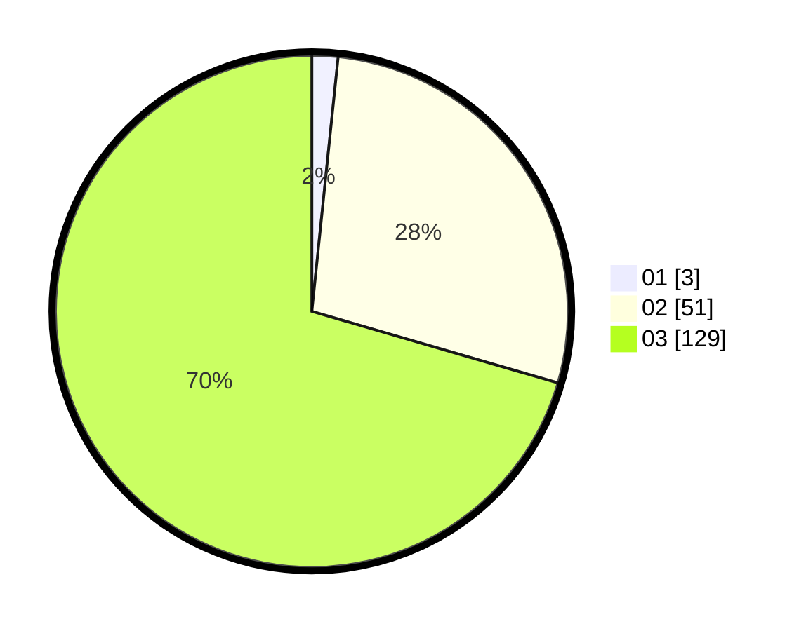

# Hasil

Hasil perolehan suara paslon dapat dilihat pada file paslon-01.txt, paslon-02.txt, dan paslon-03.txt.

Jika tidak ada, artinya data tersebut belum ada pada SIREKAP.

## Perolehan Suara

 * Paslon 01: **3**.
 * Paslon 02: **51**.
 * Paslon 03: **129**.

## Foto C Plano

https://sirekap-obj-formc.kpu.go.id/07a5/pemilu/ppwp/31/73/04/10/11/3173041011008-20240214-195856--39fa3d1c-5573-45ad-8fbe-3dce7af41fdc.jpg

https://sirekap-obj-formc.kpu.go.id/07a5/pemilu/ppwp/31/73/04/10/11/3173041011008-20240214-193658--345c86d2-60bb-4cd1-ae21-61464ff31ba8.jpg

https://sirekap-obj-formc.kpu.go.id/07a5/pemilu/ppwp/31/73/04/10/11/3173041011008-20240214-160056--2501d269-31b8-4381-9bc5-5b47f76c527f.jpg
