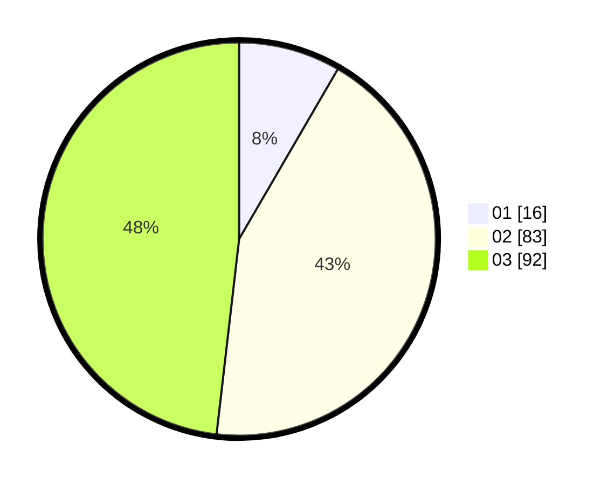

# Hasil

Hasil perolehan suara paslon dapat dilihat pada file paslon-01.txt, paslon-02.txt, dan paslon-03.txt.

Jika tidak ada, artinya data tersebut belum ada pada SIREKAP.

## Perolehan Suara

 * Paslon 01: **16**.
 * Paslon 02: **83**.
 * Paslon 03: **92**.

## Foto C Plano

https://sirekap-obj-formc.kpu.go.id/6e7c/pemilu/ppwp/31/73/04/10/11/3173041011009-20240214-194951--071ff093-c10b-48ad-b5c6-1008ca190ee7.jpg

https://sirekap-obj-formc.kpu.go.id/6e7c/pemilu/ppwp/31/73/04/10/11/3173041011009-20240214-195110--3600883a-0f6a-42d1-9161-8fc3775cf6b3.jpg

https://sirekap-obj-formc.kpu.go.id/6e7c/pemilu/ppwp/31/73/04/10/11/3173041011009-20240214-195202--1bc5f1d0-1bd3-439c-a369-5f0293b73d38.jpg

## DATA PEMILIH TETAP

Jumlah pemilih dalam DPT: **241**.
 * L: **111**.
 * P: **130**.

## DATA PENGGUNA HAK PILIH

Jumlah pengguna hak pilih dalam DPT: **190**.
 * L: **82**.
 * P: **108**.

Jumlah pengguna hak pilih dalam DPTb: **0**.
 * L: **0**.
 * P: **0**.

Jumlah pengguna hak pilih dalam DPK: **3**.
 * L: **1**.
 * P: **2**.

Jumlah pengguna hak pilih: **193**.
 * L: **83**.
 * P: **110**.

## JUMLAH SUARA SAH DAN TIDAK SAH

JUMLAH SELURUH SUARA SAH: **191**.

JUMLAH SUARA TIDAK SAH: **2**.

JUMLAH SELURUH SUARA SAH DAN SUARA TIDAK SAH: **193**.
