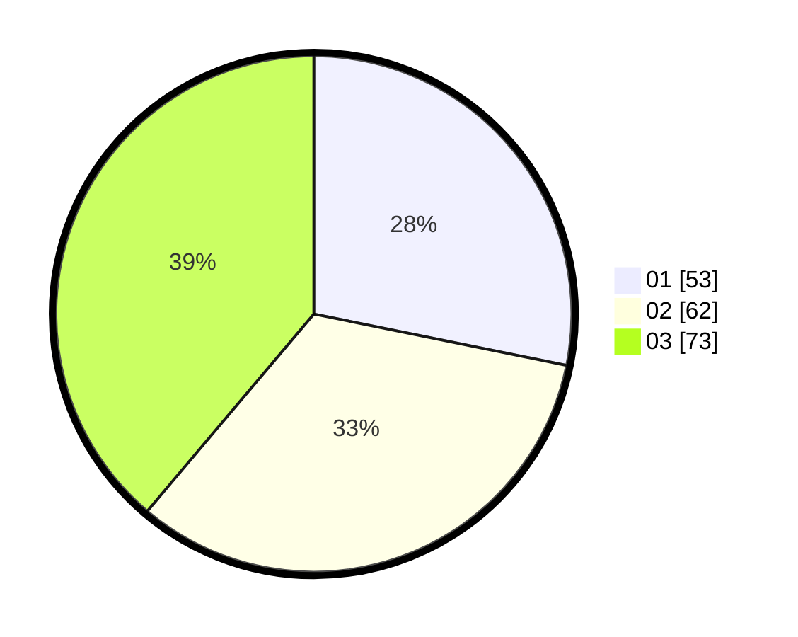

# Hasil

Hasil perolehan suara paslon dapat dilihat pada file paslon-01.txt, paslon-02.txt, dan paslon-03.txt.

Jika tidak ada, artinya data tersebut belum ada pada SIREKAP.

## Perolehan Suara

 * Paslon 01: **53**.
 * Paslon 02: **62**.
 * Paslon 03: **73**.

## Foto C Plano

https://sirekap-obj-formc.kpu.go.id/c91b/pemilu/ppwp/31/73/04/10/11/3173041011014-20240215-003111--0275f014-4269-4f26-900b-04bac8b31a0f.jpg

https://sirekap-obj-formc.kpu.go.id/c91b/pemilu/ppwp/31/73/04/10/11/3173041011014-20240215-003145--353d5ad9-264e-49cb-ad40-933f4864b127.jpg

https://sirekap-obj-formc.kpu.go.id/c91b/pemilu/ppwp/31/73/04/10/11/3173041011014-20240215-003214--22b8aedf-c403-49ca-a1b2-a72c93365865.jpg
