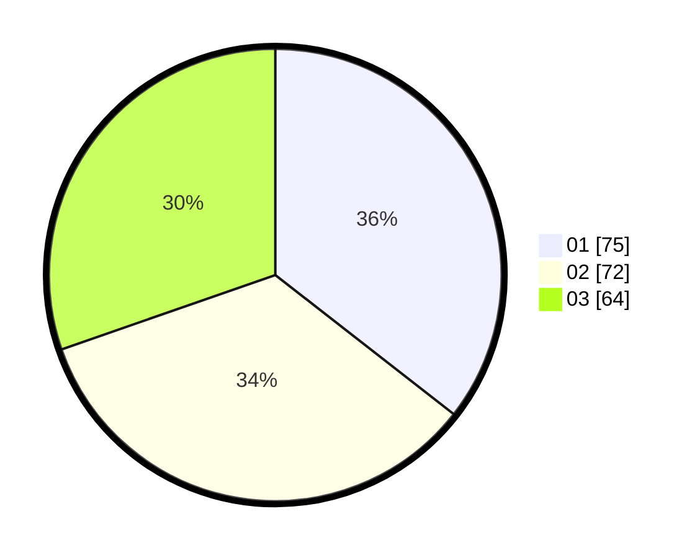

# Hasil

Hasil perolehan suara paslon dapat dilihat pada file paslon-01.txt, paslon-02.txt, dan paslon-03.txt.

Jika tidak ada, artinya data tersebut belum ada pada SIREKAP.

## Perolehan Suara

 * Paslon 01: **75**.
 * Paslon 02: **72**.
 * Paslon 03: **64**.

## Foto C Plano

https://sirekap-obj-formc.kpu.go.id/81c1/pemilu/ppwp/31/73/04/10/11/3173041011018-20240215-210614--485d318a-9642-44c8-ba7c-618e5b8d2723.jpg

https://sirekap-obj-formc.kpu.go.id/81c1/pemilu/ppwp/31/73/04/10/11/3173041011018-20240215-210616--fc39ea1c-83f0-4878-a8c8-aed618e7c84e.jpg

https://sirekap-obj-formc.kpu.go.id/81c1/pemilu/ppwp/31/73/04/10/11/3173041011018-20240215-210615--c023469e-2ce4-4bae-9960-6aebbb075744.jpg

## DATA PEMILIH TETAP

Jumlah pemilih dalam DPT: **276**.
 * L: **143**.
 * P: **133**.

## DATA PENGGUNA HAK PILIH

Jumlah pengguna hak pilih dalam DPT: **213**.
 * L: **117**.
 * P: **96**.

Jumlah pengguna hak pilih dalam DPTb: **0**.
 * L: **0**.
 * P: **0**.

Jumlah pengguna hak pilih dalam DPK: **4**.
 * L: **3**.
 * P: **1**.

Jumlah pengguna hak pilih: **217**.
 * L: **120**.
 * P: **97**.

## JUMLAH SUARA SAH DAN TIDAK SAH

JUMLAH SELURUH SUARA SAH: **211**.

JUMLAH SUARA TIDAK SAH: **6**.

JUMLAH SELURUH SUARA SAH DAN SUARA TIDAK SAH: **217**.
