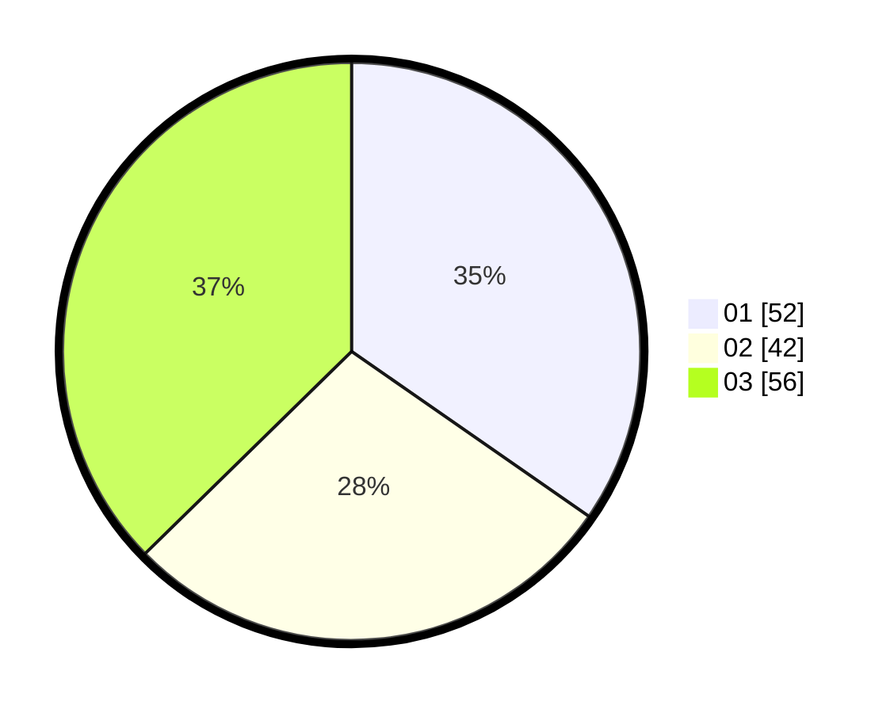

# Hasil

Hasil perolehan suara paslon dapat dilihat pada file paslon-01.txt, paslon-02.txt, dan paslon-03.txt.

Jika tidak ada, artinya data tersebut belum ada pada SIREKAP.

## Perolehan Suara

 * Paslon 01: **52**.
 * Paslon 02: **42**.
 * Paslon 03: **56**.

## Foto C Plano

https://sirekap-obj-formc.kpu.go.id/263b/pemilu/ppwp/31/73/04/10/11/3173041011019-20240215-175618--1d5953e8-c645-49d4-b5bc-145c72818180.jpg

https://sirekap-obj-formc.kpu.go.id/263b/pemilu/ppwp/31/73/04/10/11/3173041011019-20240215-175639--89aa70dd-49f2-413b-95ed-58b4cd7c06b3.jpg

https://sirekap-obj-formc.kpu.go.id/263b/pemilu/ppwp/31/73/04/10/11/3173041011019-20240215-175628--2d7985a2-5f34-4b11-922a-45d390f39fd9.jpg

## DATA PEMILIH TETAP

Jumlah pemilih dalam DPT: **199**.
 * L: **91**.
 * P: **108**.

## DATA PENGGUNA HAK PILIH

Jumlah pengguna hak pilih dalam DPT: **152**.
 * L: **63**.
 * P: **89**.

Jumlah pengguna hak pilih dalam DPTb: **0**.
 * L: **0**.
 * P: **0**.

Jumlah pengguna hak pilih dalam DPK: **1**.
 * L: **1**.
 * P: **0**.

Jumlah pengguna hak pilih: **153**.
 * L: **64**.
 * P: **89**.

## JUMLAH SUARA SAH DAN TIDAK SAH

JUMLAH SELURUH SUARA SAH: **150**.

JUMLAH SUARA TIDAK SAH: **3**.

JUMLAH SELURUH SUARA SAH DAN SUARA TIDAK SAH: **153**.
