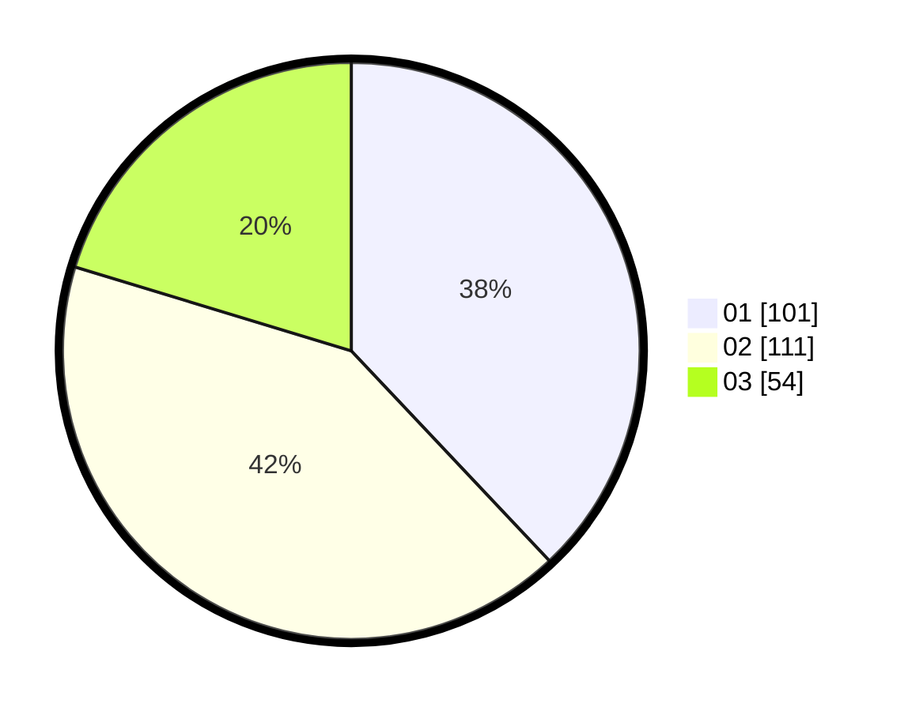

# Hasil

Hasil perolehan suara paslon dapat dilihat pada file paslon-01.txt, paslon-02.txt, dan paslon-03.txt.

Jika tidak ada, artinya data tersebut belum ada pada SIREKAP.

## Perolehan Suara

 * Paslon 01: **101**.
 * Paslon 02: **111**.
 * Paslon 03: **54**.

## Foto C Plano

https://sirekap-obj-formc.kpu.go.id/0795/pemilu/ppwp/31/73/04/10/11/3173041011020-20240215-224931--3bb4d966-d812-4d6f-96f8-6ccc1332d512.jpg

https://sirekap-obj-formc.kpu.go.id/0795/pemilu/ppwp/31/73/04/10/11/3173041011020-20240215-224933--5756c8c6-da04-49aa-ac38-8479c58ec4d1.jpg

https://sirekap-obj-formc.kpu.go.id/0795/pemilu/ppwp/31/73/04/10/11/3173041011020-20240215-224931--63150415-c3e3-422e-82e9-798c135b01d0.jpg

## DATA PEMILIH TETAP

Jumlah pemilih dalam DPT: **269**.
 * L: **127**.
 * P: **142**.

## DATA PENGGUNA HAK PILIH

Jumlah pengguna hak pilih dalam DPT: **202**.
 * L: **90**.
 * P: **112**.

Jumlah pengguna hak pilih dalam DPTb: **0**.
 * L: **0**.
 * P: **0**.

Jumlah pengguna hak pilih dalam DPK: **1**.
 * L: **1**.
 * P: **0**.

Jumlah pengguna hak pilih: **203**.
 * L: **91**.
 * P: **112**.

## JUMLAH SUARA SAH DAN TIDAK SAH

JUMLAH SELURUH SUARA SAH: **202**.

JUMLAH SUARA TIDAK SAH: **1**.

JUMLAH SELURUH SUARA SAH DAN SUARA TIDAK SAH: **203**.
