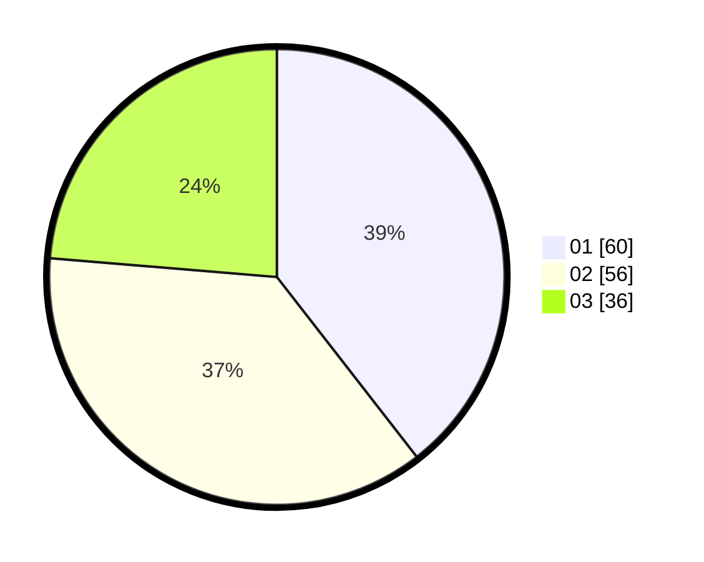

# Hasil

Hasil perolehan suara paslon dapat dilihat pada file paslon-01.txt, paslon-02.txt, dan paslon-03.txt.

Jika tidak ada, artinya data tersebut belum ada pada SIREKAP.

## Perolehan Suara

 * Paslon 01: **60**.
 * Paslon 02: **56**.
 * Paslon 03: **36**.

## Foto C Plano

https://sirekap-obj-formc.kpu.go.id/8af1/pemilu/ppwp/31/73/04/10/11/3173041011023-20240216-004656--30557544-7516-4626-8286-d3387e95d9bf.jpg

https://sirekap-obj-formc.kpu.go.id/8af1/pemilu/ppwp/31/73/04/10/11/3173041011023-20240216-004702--b45740b8-bd85-4318-94fa-0015c5fb4789.jpg

https://sirekap-obj-formc.kpu.go.id/8af1/pemilu/ppwp/31/73/04/10/11/3173041011023-20240216-004657--a6423536-c1e9-46d6-89d6-ec5544e535af.jpg

## DATA PEMILIH TETAP

Jumlah pemilih dalam DPT: **202**.
 * L: **102**.
 * P: **100**.

## DATA PENGGUNA HAK PILIH

Jumlah pengguna hak pilih dalam DPT: **150**.
 * L: **73**.
 * P: **77**.

Jumlah pengguna hak pilih dalam DPTb: **3**.
 * L: **2**.
 * P: **1**.

Jumlah pengguna hak pilih dalam DPK: **1**.
 * L: **1**.
 * P: **0**.

Jumlah pengguna hak pilih: **154**.
 * L: **76**.
 * P: **78**.

## JUMLAH SUARA SAH DAN TIDAK SAH

JUMLAH SELURUH SUARA SAH: **152**.

JUMLAH SUARA TIDAK SAH: **2**.

JUMLAH SELURUH SUARA SAH DAN SUARA TIDAK SAH: **154**.
