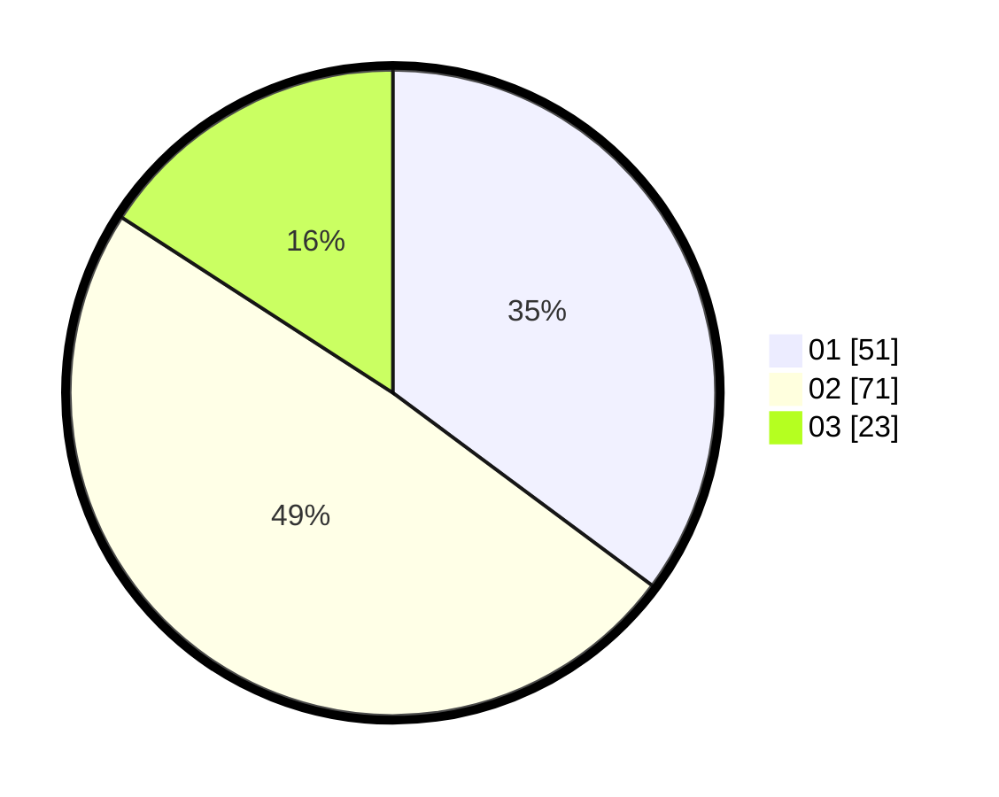

# Hasil

Hasil perolehan suara paslon dapat dilihat pada file paslon-01.txt, paslon-02.txt, dan paslon-03.txt.

Jika tidak ada, artinya data tersebut belum ada pada SIREKAP.

## Perolehan Suara

 * Paslon 01: **51**.
 * Paslon 02: **71**.
 * Paslon 03: **23**.

## Foto C Plano

https://sirekap-obj-formc.kpu.go.id/c211/pemilu/ppwp/31/73/04/10/11/3173041011025-20240216-070241--10c465ff-9ccb-4258-9f0f-d5c63f763a5a.jpg

https://sirekap-obj-formc.kpu.go.id/c211/pemilu/ppwp/31/73/04/10/11/3173041011025-20240216-070243--ff385493-d9d4-4651-a0d6-1a8f6f772256.jpg

https://sirekap-obj-formc.kpu.go.id/c211/pemilu/ppwp/31/73/04/10/11/3173041011025-20240216-070242--4d4a5006-3c85-49cd-9e28-95b030d5bc35.jpg

## DATA PEMILIH TETAP

Jumlah pemilih dalam DPT: **167**.
 * L: **80**.
 * P: **87**.

## DATA PENGGUNA HAK PILIH

Jumlah pengguna hak pilih dalam DPT: **146**.
 * L: **68**.
 * P: **78**.

Jumlah pengguna hak pilih dalam DPTb: **0**.
 * L: **0**.
 * P: **0**.

Jumlah pengguna hak pilih dalam DPK: **0**.
 * L: **0**.
 * P: **0**.

Jumlah pengguna hak pilih: **0**.
 * L: **0**.
 * P: **0**.

## JUMLAH SUARA SAH DAN TIDAK SAH

JUMLAH SELURUH SUARA SAH: **145**.

JUMLAH SUARA TIDAK SAH: **1**.

JUMLAH SELURUH SUARA SAH DAN SUARA TIDAK SAH: **146**.
