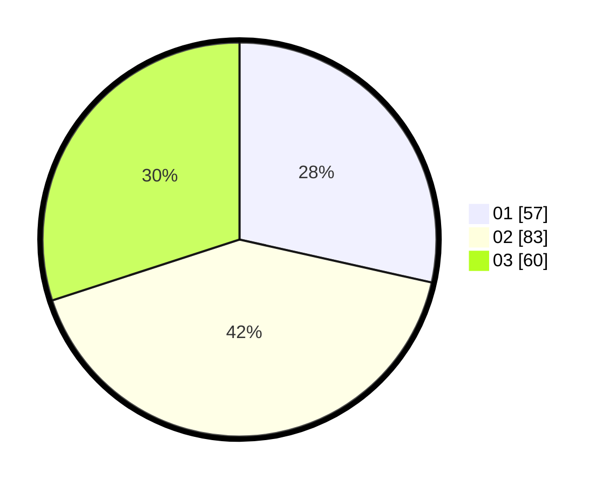

# Hasil

Hasil perolehan suara paslon dapat dilihat pada file paslon-01.txt, paslon-02.txt, dan paslon-03.txt.

Jika tidak ada, artinya data tersebut belum ada pada SIREKAP.

## Perolehan Suara

 * Paslon 01: **57**.
 * Paslon 02: **83**.
 * Paslon 03: **60**.

## Foto C Plano

https://sirekap-obj-formc.kpu.go.id/432c/pemilu/ppwp/31/73/04/10/11/3173041011027-20240215-222018--dcd8ade0-d3a8-4ed3-bcd9-d60dad8760f1.jpg

https://sirekap-obj-formc.kpu.go.id/432c/pemilu/ppwp/31/73/04/10/11/3173041011027-20240215-222020--c88ed9e8-02de-4ba8-8c33-25f1da952840.jpg

https://sirekap-obj-formc.kpu.go.id/432c/pemilu/ppwp/31/73/04/10/11/3173041011027-20240215-222019--867668c7-7371-4dce-bf06-8e49dc0c1512.jpg

## DATA PEMILIH TETAP

Jumlah pemilih dalam DPT: **268**.
 * L: **139**.
 * P: **129**.

## DATA PENGGUNA HAK PILIH

Jumlah pengguna hak pilih dalam DPT: **206**.
 * L: **101**.
 * P: **105**.

Jumlah pengguna hak pilih dalam DPTb: **0**.
 * L: **0**.
 * P: **0**.

Jumlah pengguna hak pilih dalam DPK: **0**.
 * L: **0**.
 * P: **0**.

Jumlah pengguna hak pilih: **206**.
 * L: **101**.
 * P: **105**.

## JUMLAH SUARA SAH DAN TIDAK SAH

JUMLAH SELURUH SUARA SAH: **200**.

JUMLAH SUARA TIDAK SAH: **6**.

JUMLAH SELURUH SUARA SAH DAN SUARA TIDAK SAH: **206**.
