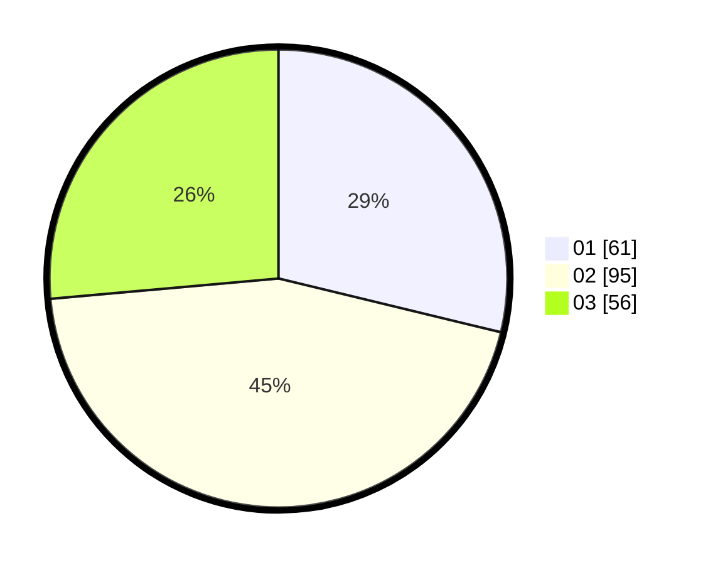

# Hasil

Hasil perolehan suara paslon dapat dilihat pada file paslon-01.txt, paslon-02.txt, dan paslon-03.txt.

Jika tidak ada, artinya data tersebut belum ada pada SIREKAP.

## Perolehan Suara

 * Paslon 01: **61**.
 * Paslon 02: **95**.
 * Paslon 03: **56**.

## Foto C Plano

https://sirekap-obj-formc.kpu.go.id/d5f5/pemilu/ppwp/31/73/04/10/11/3173041011031-20240216-141748--b8b50499-6879-410e-855a-859818c09a48.jpg

https://sirekap-obj-formc.kpu.go.id/d5f5/pemilu/ppwp/31/73/04/10/11/3173041011031-20240216-141749--a29728d5-5dba-4bd3-838e-14970d65ebd3.jpg

https://sirekap-obj-formc.kpu.go.id/d5f5/pemilu/ppwp/31/73/04/10/11/3173041011031-20240216-141748--9306dd79-cfad-457e-bba0-0919a6de7b61.jpg

## DATA PEMILIH TETAP

Jumlah pemilih dalam DPT: **275**.
 * L: **134**.
 * P: **141**.

## DATA PENGGUNA HAK PILIH

Jumlah pengguna hak pilih dalam DPT: **207**.
 * L: **92**.
 * P: **115**.

Jumlah pengguna hak pilih dalam DPTb: **0**.
 * L: **0**.
 * P: **0**.

Jumlah pengguna hak pilih dalam DPK: **6**.
 * L: **1**.
 * P: **5**.

Jumlah pengguna hak pilih: **213**.
 * L: **93**.
 * P: **120**.

## JUMLAH SUARA SAH DAN TIDAK SAH

JUMLAH SELURUH SUARA SAH: **212**.

JUMLAH SUARA TIDAK SAH: **1**.

JUMLAH SELURUH SUARA SAH DAN SUARA TIDAK SAH: **213**.
