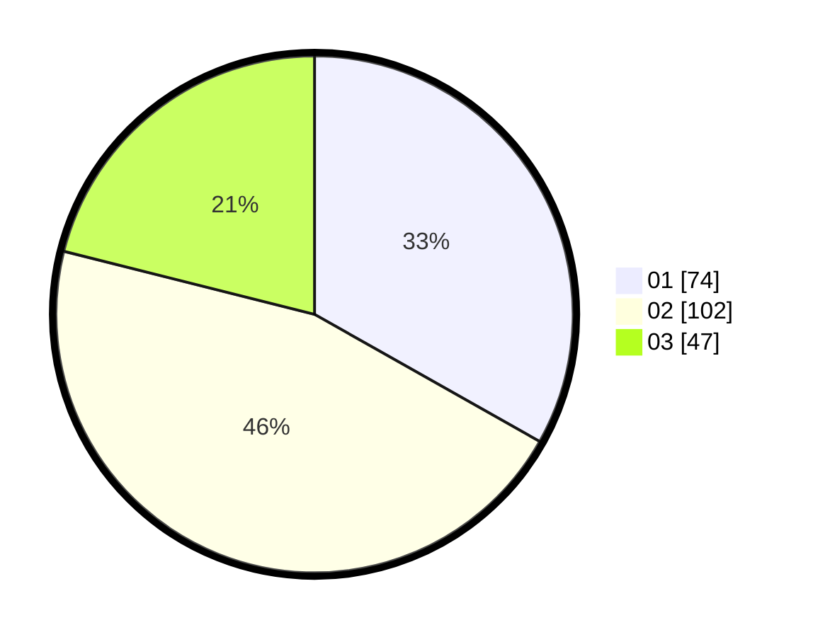

# Hasil

Hasil perolehan suara paslon dapat dilihat pada file paslon-01.txt, paslon-02.txt, dan paslon-03.txt.

Jika tidak ada, artinya data tersebut belum ada pada SIREKAP.

## Perolehan Suara

 * Paslon 01: **74**.
 * Paslon 02: **102**.
 * Paslon 03: **47**.

## Foto C Plano

https://sirekap-obj-formc.kpu.go.id/344d/pemilu/ppwp/31/73/04/10/11/3173041011032-20240214-215237--1ac659a7-b0fa-432c-ae73-5c940ad3446b.jpg

https://sirekap-obj-formc.kpu.go.id/344d/pemilu/ppwp/31/73/04/10/11/3173041011032-20240214-215318--c76ab58a-3c9b-4c19-a84a-6484f18200a8.jpg

https://sirekap-obj-formc.kpu.go.id/344d/pemilu/ppwp/31/73/04/10/11/3173041011032-20240214-215418--a8461808-2822-48cd-add0-37c816c0fe88.jpg

## DATA PEMILIH TETAP

Jumlah pemilih dalam DPT: **282**.
 * L: **140**.
 * P: **142**.

## DATA PENGGUNA HAK PILIH

Jumlah pengguna hak pilih dalam DPT: **229**.
 * L: **114**.
 * P: **115**.

Jumlah pengguna hak pilih dalam DPTb: **0**.
 * L: **0**.
 * P: **0**.

Jumlah pengguna hak pilih dalam DPK: **0**.
 * L: **0**.
 * P: **0**.

Jumlah pengguna hak pilih: **229**.
 * L: **114**.
 * P: **115**.

## JUMLAH SUARA SAH DAN TIDAK SAH

JUMLAH SELURUH SUARA SAH: **223**.

JUMLAH SUARA TIDAK SAH: **6**.

JUMLAH SELURUH SUARA SAH DAN SUARA TIDAK SAH: **229**.
