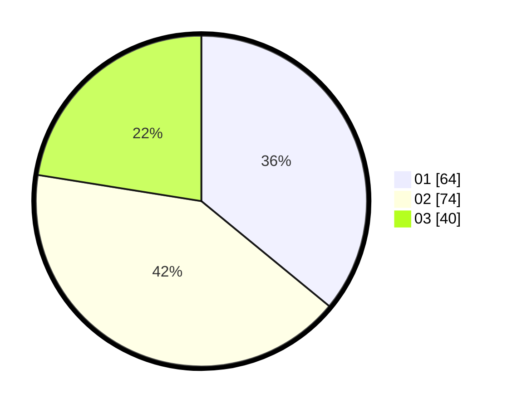

# Hasil

Hasil perolehan suara paslon dapat dilihat pada file paslon-01.txt, paslon-02.txt, dan paslon-03.txt.

Jika tidak ada, artinya data tersebut belum ada pada SIREKAP.

## Perolehan Suara

 * Paslon 01: **64**.
 * Paslon 02: **74**.
 * Paslon 03: **40**.

## Foto C Plano

https://sirekap-obj-formc.kpu.go.id/8314/pemilu/ppwp/31/73/04/10/11/3173041011041-20240216-222150--fd325315-5e7f-4450-bb24-92f2e757937a.jpg

https://sirekap-obj-formc.kpu.go.id/8314/pemilu/ppwp/31/73/04/10/11/3173041011041-20240216-222333--809df836-0eea-4377-acf0-947b6a3259fe.jpg

https://sirekap-obj-formc.kpu.go.id/8314/pemilu/ppwp/31/73/04/10/11/3173041011041-20240216-222251--d6660aef-3eb6-4a08-9512-20cbdc3fdd5c.jpg

## DATA PEMILIH TETAP

Jumlah pemilih dalam DPT: **252**.
 * L: **131**.
 * P: **121**.

## DATA PENGGUNA HAK PILIH

Jumlah pengguna hak pilih dalam DPT: **177**.
 * L: **90**.
 * P: **87**.

Jumlah pengguna hak pilih dalam DPTb: **1**.
 * L: **1**.
 * P: **0**.

Jumlah pengguna hak pilih dalam DPK: **2**.
 * L: **1**.
 * P: **1**.

Jumlah pengguna hak pilih: **180**.
 * L: **92**.
 * P: **88**.

## JUMLAH SUARA SAH DAN TIDAK SAH

JUMLAH SELURUH SUARA SAH: **178**.

JUMLAH SUARA TIDAK SAH: **2**.

JUMLAH SELURUH SUARA SAH DAN SUARA TIDAK SAH: **180**.
