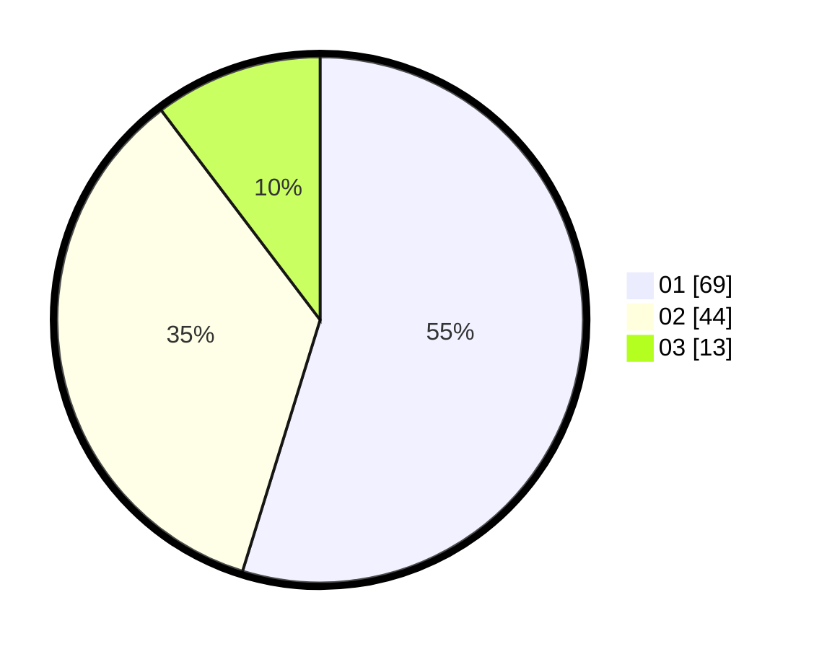

# Hasil

Hasil perolehan suara paslon dapat dilihat pada file paslon-01.txt, paslon-02.txt, dan paslon-03.txt.

Jika tidak ada, artinya data tersebut belum ada pada SIREKAP.

## Perolehan Suara

 * Paslon 01: **69**.
 * Paslon 02: **44**.
 * Paslon 03: **13**.

## Foto C Plano

https://sirekap-obj-formc.kpu.go.id/7f43/pemilu/ppwp/31/73/04/10/11/3173041011046-20240214-155113--1b6e6d3f-9a18-40d9-ace7-e39b81595441.jpg

https://sirekap-obj-formc.kpu.go.id/7f43/pemilu/ppwp/31/73/04/10/11/3173041011046-20240214-155117--ffa3c9ad-20dc-4a0f-a48a-746f1aa0aa04.jpg

https://sirekap-obj-formc.kpu.go.id/7f43/pemilu/ppwp/31/73/04/10/11/3173041011046-20240214-155209--0777f17e-6b87-4309-939e-7ae643fb1fc8.jpg

## DATA PEMILIH TETAP

Jumlah pemilih dalam DPT: **163**.
 * L: **85**.
 * P: **78**.

## DATA PENGGUNA HAK PILIH

Jumlah pengguna hak pilih dalam DPT: **127**.
 * L: **67**.
 * P: **60**.

Jumlah pengguna hak pilih dalam DPTb: **0**.
 * L: **0**.
 * P: **0**.

Jumlah pengguna hak pilih dalam DPK: **0**.
 * L: **0**.
 * P: **0**.

Jumlah pengguna hak pilih: **127**.
 * L: **67**.
 * P: **60**.

## JUMLAH SUARA SAH DAN TIDAK SAH

JUMLAH SELURUH SUARA SAH: **126**.

JUMLAH SUARA TIDAK SAH: **1**.

JUMLAH SELURUH SUARA SAH DAN SUARA TIDAK SAH: **127**.
