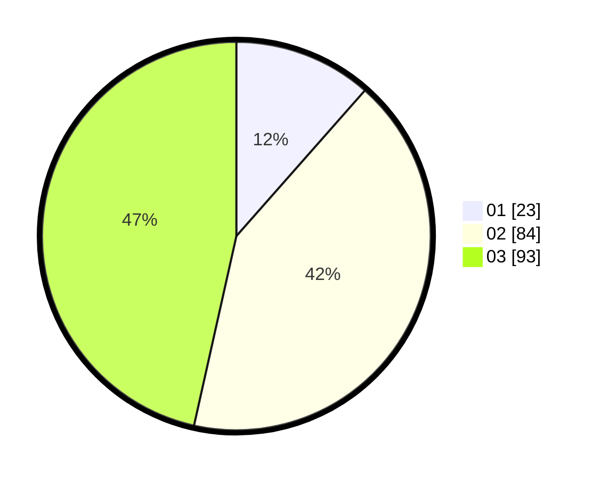

# Hasil

Hasil perolehan suara paslon dapat dilihat pada file paslon-01.txt, paslon-02.txt, dan paslon-03.txt.

Jika tidak ada, artinya data tersebut belum ada pada SIREKAP.

## Perolehan Suara

 * Paslon 01: **23**.
 * Paslon 02: **84**.
 * Paslon 03: **93**.

## Foto C Plano

https://sirekap-obj-formc.kpu.go.id/0a11/pemilu/ppwp/31/73/04/10/11/3173041011047-20240215-223344--93f4ebf7-ea5c-4638-8540-3c96267fb981.jpg

https://sirekap-obj-formc.kpu.go.id/0a11/pemilu/ppwp/31/73/04/10/11/3173041011047-20240215-223346--238a9abd-084f-4d37-9aa8-b24a27cafc91.jpg

https://sirekap-obj-formc.kpu.go.id/0a11/pemilu/ppwp/31/73/04/10/11/3173041011047-20240215-223345--49e26da5-561d-401f-8962-09c31d92df36.jpg

## DATA PEMILIH TETAP

Jumlah pemilih dalam DPT: **278**.
 * L: **130**.
 * P: **148**.

## DATA PENGGUNA HAK PILIH

Jumlah pengguna hak pilih dalam DPT: **202**.
 * L: **99**.
 * P: **103**.

Jumlah pengguna hak pilih dalam DPTb: **0**.
 * L: **0**.
 * P: **0**.

Jumlah pengguna hak pilih dalam DPK: **0**.
 * L: **0**.
 * P: **0**.

Jumlah pengguna hak pilih: **202**.
 * L: **99**.
 * P: **103**.

## JUMLAH SUARA SAH DAN TIDAK SAH

JUMLAH SELURUH SUARA SAH: **200**.

JUMLAH SUARA TIDAK SAH: **2**.

JUMLAH SELURUH SUARA SAH DAN SUARA TIDAK SAH: **202**.
