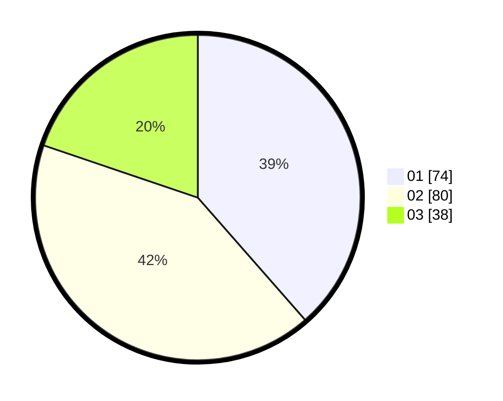

# Hasil

Hasil perolehan suara paslon dapat dilihat pada file paslon-01.txt, paslon-02.txt, dan paslon-03.txt.

Jika tidak ada, artinya data tersebut belum ada pada SIREKAP.

## Perolehan Suara

 * Paslon 01: **74**.
 * Paslon 02: **80**.
 * Paslon 03: **38**.

## Foto C Plano

https://sirekap-obj-formc.kpu.go.id/b619/pemilu/ppwp/31/73/04/10/11/3173041011050-20240215-000529--495e3663-d925-4999-b41d-56ead7743c2d.jpg

https://sirekap-obj-formc.kpu.go.id/b619/pemilu/ppwp/31/73/04/10/11/3173041011050-20240215-000652--c87b4094-f5eb-4337-bd27-c1713d8a0d9c.jpg

https://sirekap-obj-formc.kpu.go.id/b619/pemilu/ppwp/31/73/04/10/11/3173041011050-20240215-000734--9734a9ae-df5c-43f7-95d5-348e20921045.jpg
