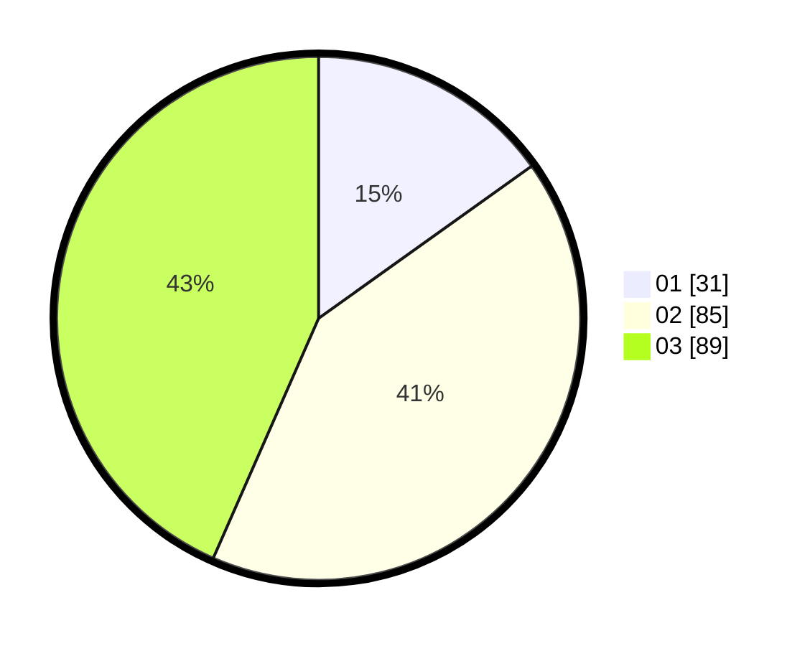

# Hasil

Hasil perolehan suara paslon dapat dilihat pada file paslon-01.txt, paslon-02.txt, dan paslon-03.txt.

Jika tidak ada, artinya data tersebut belum ada pada SIREKAP.

## Perolehan Suara

 * Paslon 01: **31**.
 * Paslon 02: **85**.
 * Paslon 03: **89**.

## Foto C Plano

https://sirekap-obj-formc.kpu.go.id/0e82/pemilu/ppwp/31/73/04/10/11/3173041011052-20240215-012805--fc9bf005-5c00-426d-9111-a7704cb277e0.jpg

https://sirekap-obj-formc.kpu.go.id/0e82/pemilu/ppwp/31/73/04/10/11/3173041011052-20240215-013202--f00bfa84-c87a-4295-9851-aed937bcf85d.jpg

https://sirekap-obj-formc.kpu.go.id/0e82/pemilu/ppwp/31/73/04/10/11/3173041011052-20240215-013337--cee8d044-24b0-4b0f-898d-7b6473e4cea7.jpg
