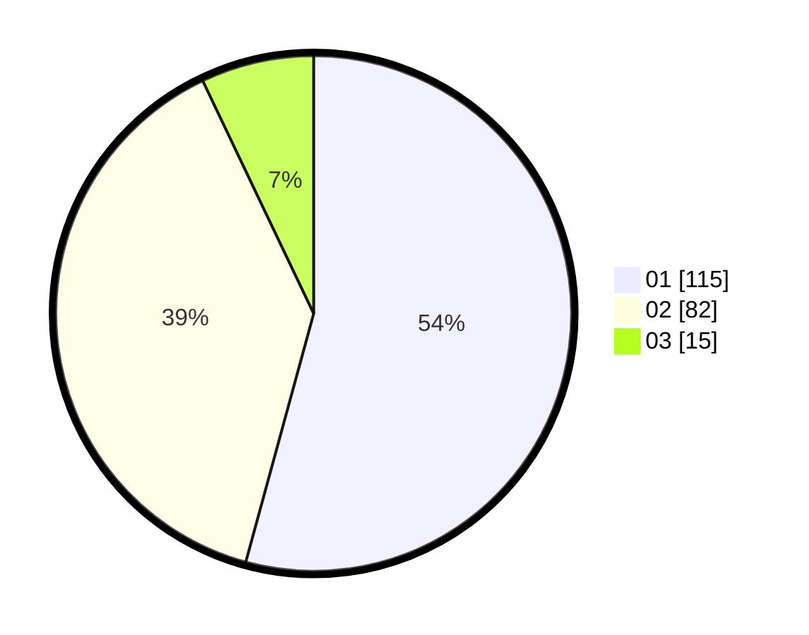

# Hasil

Hasil perolehan suara paslon dapat dilihat pada file paslon-01.txt, paslon-02.txt, dan paslon-03.txt.

Jika tidak ada, artinya data tersebut belum ada pada SIREKAP.

## Perolehan Suara

 * Paslon 01: **115**.
 * Paslon 02: **82**.
 * Paslon 03: **15**.

## Foto C Plano

https://sirekap-obj-formc.kpu.go.id/fe48/pemilu/ppwp/31/73/05/10/01/3173051001003-20240214-213603--569566ea-acd0-4f48-aea3-267474c567a6.jpg

https://sirekap-obj-formc.kpu.go.id/fe48/pemilu/ppwp/31/73/05/10/01/3173051001003-20240214-230543--5bb14532-587f-419a-831d-bc66ea447b5c.jpg

https://sirekap-obj-formc.kpu.go.id/fe48/pemilu/ppwp/31/73/05/10/01/3173051001003-20240214-213857--9a53e65e-ece7-4dd9-9260-037ca18b5e4a.jpg

## DATA PEMILIH TETAP

Jumlah pemilih dalam DPT: **274**.
 * L: **139**.
 * P: **135**.

## DATA PENGGUNA HAK PILIH

Jumlah pengguna hak pilih dalam DPT: **219**.
 * L: **109**.
 * P: **110**.

Jumlah pengguna hak pilih dalam DPTb: **0**.
 * L: **0**.
 * P: **0**.

Jumlah pengguna hak pilih dalam DPK: **1**.
 * L: **0**.
 * P: **1**.

Jumlah pengguna hak pilih: **220**.
 * L: **109**.
 * P: **111**.

## JUMLAH SUARA SAH DAN TIDAK SAH

JUMLAH SELURUH SUARA SAH: **212**.

JUMLAH SUARA TIDAK SAH: **8**.

JUMLAH SELURUH SUARA SAH DAN SUARA TIDAK SAH: **220**.
