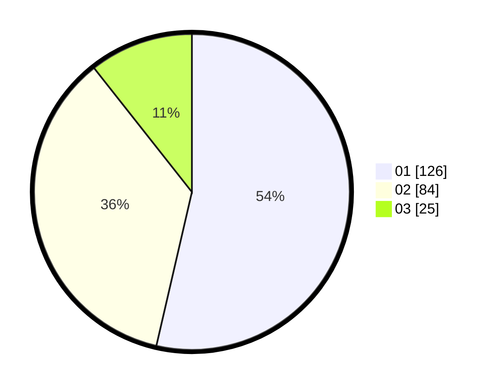

# Hasil

Hasil perolehan suara paslon dapat dilihat pada file paslon-01.txt, paslon-02.txt, dan paslon-03.txt.

Jika tidak ada, artinya data tersebut belum ada pada SIREKAP.

## Perolehan Suara

 * Paslon 01: **126**.
 * Paslon 02: **84**.
 * Paslon 03: **25**.

## Foto C Plano

https://sirekap-obj-formc.kpu.go.id/f006/pemilu/ppwp/31/73/05/10/01/3173051001004-20240215-011007--b40b18bd-0083-4d6a-a100-55f05f2fcbea.jpg

https://sirekap-obj-formc.kpu.go.id/f006/pemilu/ppwp/31/73/05/10/01/3173051001004-20240214-212853--83abb8dc-d19b-407e-91db-9d89bfe6d78a.jpg

https://sirekap-obj-formc.kpu.go.id/f006/pemilu/ppwp/31/73/05/10/01/3173051001004-20240214-212910--79532fda-86b0-4772-821f-bde3c3efaee7.jpg
