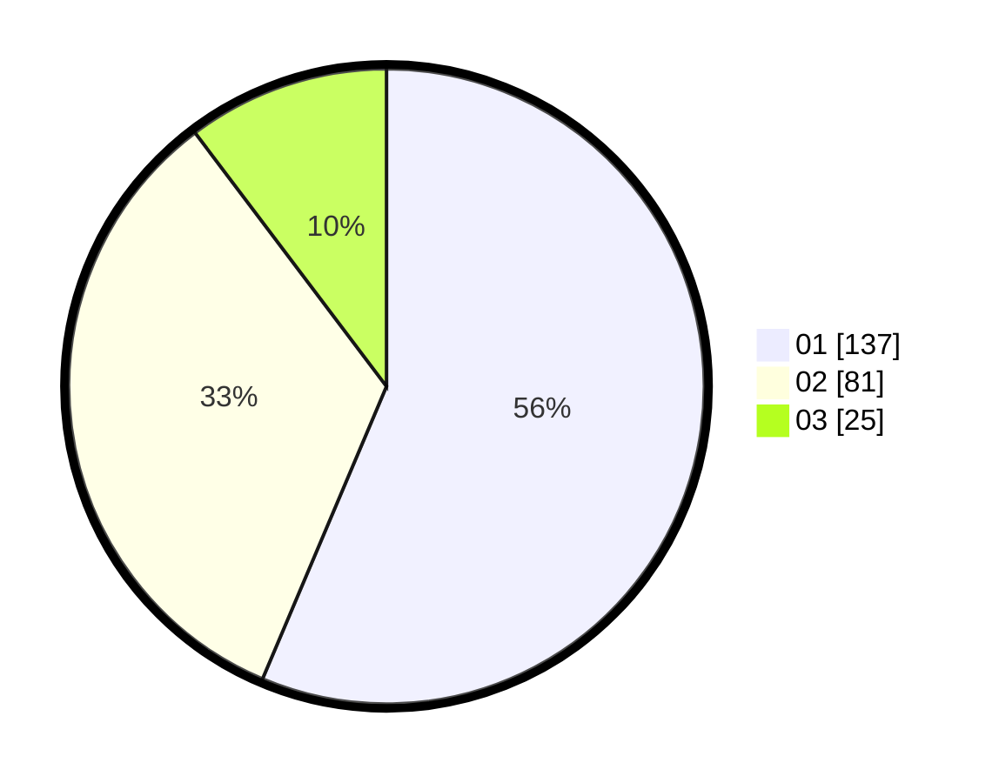

# Hasil

Hasil perolehan suara paslon dapat dilihat pada file paslon-01.txt, paslon-02.txt, dan paslon-03.txt.

Jika tidak ada, artinya data tersebut belum ada pada SIREKAP.

## Perolehan Suara

 * Paslon 01: **137**.
 * Paslon 02: **81**.
 * Paslon 03: **25**.

## Foto C Plano

https://sirekap-obj-formc.kpu.go.id/341c/pemilu/ppwp/31/73/05/10/01/3173051001009-20240215-002715--a5234c71-04a0-438b-9276-28e71004eda7.jpg

https://sirekap-obj-formc.kpu.go.id/341c/pemilu/ppwp/31/73/05/10/01/3173051001009-20240214-211456--c8179105-b04f-4ac7-a7dd-48d02b019e89.jpg

https://sirekap-obj-formc.kpu.go.id/341c/pemilu/ppwp/31/73/05/10/01/3173051001009-20240214-211621--80984463-6b0b-4ebb-accc-88a545137ccb.jpg
