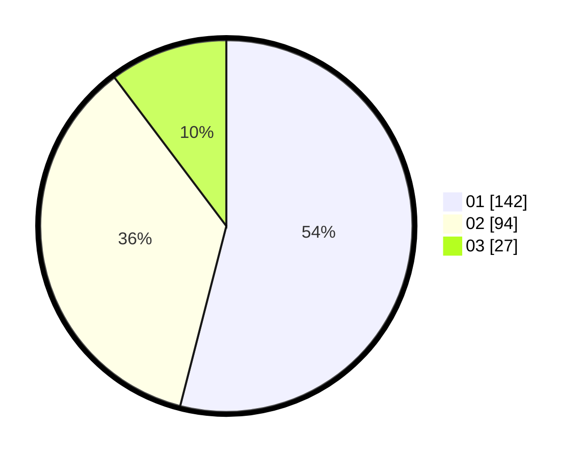

# Hasil

Hasil perolehan suara paslon dapat dilihat pada file paslon-01.txt, paslon-02.txt, dan paslon-03.txt.

Jika tidak ada, artinya data tersebut belum ada pada SIREKAP.

## Perolehan Suara

 * Paslon 01: **142**.
 * Paslon 02: **94**.
 * Paslon 03: **27**.

## Foto C Plano

https://sirekap-obj-formc.kpu.go.id/670d/pemilu/ppwp/31/73/05/10/01/3173051001011-20240214-203751--c81cbe4f-0506-4830-89bb-0868d79cca36.jpg

https://sirekap-obj-formc.kpu.go.id/670d/pemilu/ppwp/31/73/05/10/01/3173051001011-20240214-204008--a0ccc458-24c5-42ed-8cd3-cb53e1660e7c.jpg

https://sirekap-obj-formc.kpu.go.id/670d/pemilu/ppwp/31/73/05/10/01/3173051001011-20240214-204255--cc4ee3f8-12be-4564-901d-2a8ee1d93a87.jpg

## DATA PEMILIH TETAP

Jumlah pemilih dalam DPT: **280**.
 * L: **135**.
 * P: **145**.

## DATA PENGGUNA HAK PILIH

Jumlah pengguna hak pilih dalam DPT: **253**.
 * L: **123**.
 * P: **130**.

Jumlah pengguna hak pilih dalam DPTb: **15**.
 * L: **12**.
 * P: **3**.

Jumlah pengguna hak pilih dalam DPK: **1**.
 * L: **1**.
 * P: **0**.

Jumlah pengguna hak pilih: **269**.
 * L: **136**.
 * P: **133**.

## JUMLAH SUARA SAH DAN TIDAK SAH

JUMLAH SELURUH SUARA SAH: **263**.

JUMLAH SUARA TIDAK SAH: **6**.

JUMLAH SELURUH SUARA SAH DAN SUARA TIDAK SAH: **269**.
