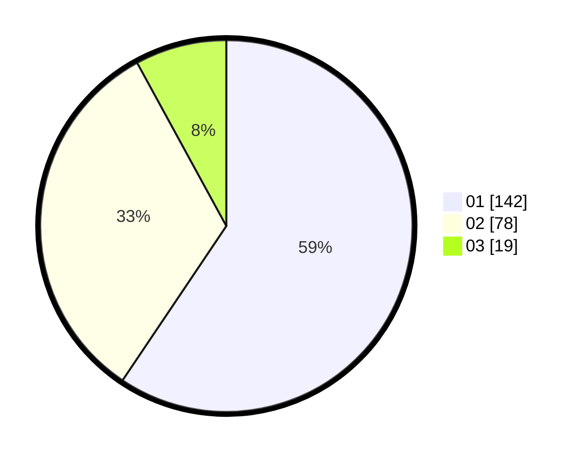

# Hasil

Hasil perolehan suara paslon dapat dilihat pada file paslon-01.txt, paslon-02.txt, dan paslon-03.txt.

Jika tidak ada, artinya data tersebut belum ada pada SIREKAP.

## Perolehan Suara

 * Paslon 01: **142**.
 * Paslon 02: **78**.
 * Paslon 03: **19**.

## Foto C Plano

https://sirekap-obj-formc.kpu.go.id/0c88/pemilu/ppwp/31/73/05/10/01/3173051001013-20240214-201352--7d976cde-d26b-4466-b72e-20e3ce4d123a.jpg

https://sirekap-obj-formc.kpu.go.id/0c88/pemilu/ppwp/31/73/05/10/01/3173051001013-20240214-201656--733626c4-deaf-454f-ac01-706519623ec0.jpg

https://sirekap-obj-formc.kpu.go.id/0c88/pemilu/ppwp/31/73/05/10/01/3173051001013-20240214-201822--2863919a-24e9-41d8-a060-3f3272627c5a.jpg

## DATA PEMILIH TETAP

Jumlah pemilih dalam DPT: **273**.
 * L: **135**.
 * P: **138**.

## DATA PENGGUNA HAK PILIH

Jumlah pengguna hak pilih dalam DPT: **224**.
 * L: **109**.
 * P: **115**.

Jumlah pengguna hak pilih dalam DPTb: **13**.
 * L: **7**.
 * P: **6**.

Jumlah pengguna hak pilih dalam DPK: **2**.
 * L: **0**.
 * P: **2**.

Jumlah pengguna hak pilih: **239**.
 * L: **116**.
 * P: **123**.

## JUMLAH SUARA SAH DAN TIDAK SAH

JUMLAH SELURUH SUARA SAH: **239**.

JUMLAH SUARA TIDAK SAH: **0**.

JUMLAH SELURUH SUARA SAH DAN SUARA TIDAK SAH: **239**.
