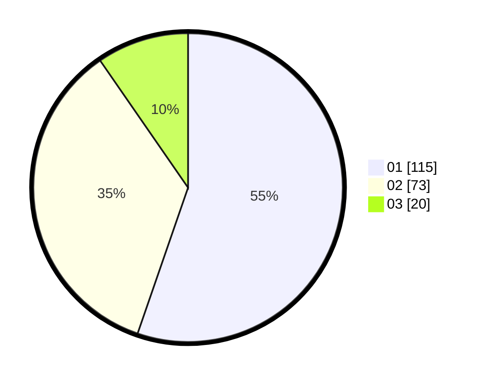

# Hasil

Hasil perolehan suara paslon dapat dilihat pada file paslon-01.txt, paslon-02.txt, dan paslon-03.txt.

Jika tidak ada, artinya data tersebut belum ada pada SIREKAP.

## Perolehan Suara

 * Paslon 01: **115**.
 * Paslon 02: **73**.
 * Paslon 03: **20**.

## Foto C Plano

https://sirekap-obj-formc.kpu.go.id/db10/pemilu/ppwp/31/73/05/10/01/3173051001023-20240215-235711--9b0cb2f1-3b36-446c-a639-740f9d9a4e35.jpg

https://sirekap-obj-formc.kpu.go.id/db10/pemilu/ppwp/31/73/05/10/01/3173051001023-20240215-235930--2f302fa8-520d-44f3-8b28-c6a1a279348f.jpg
