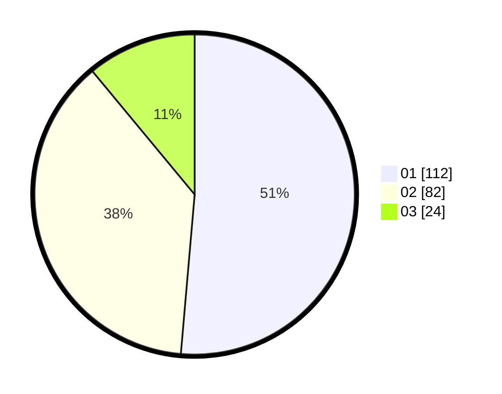

# Hasil

Hasil perolehan suara paslon dapat dilihat pada file paslon-01.txt, paslon-02.txt, dan paslon-03.txt.

Jika tidak ada, artinya data tersebut belum ada pada SIREKAP.

## Perolehan Suara

 * Paslon 01: **112**.
 * Paslon 02: **82**.
 * Paslon 03: **24**.

## Foto C Plano

https://sirekap-obj-formc.kpu.go.id/44d3/pemilu/ppwp/31/73/05/10/01/3173051001025-20240214-211302--1b0a7139-1c41-4ba8-8e64-59c06e240d2a.jpg

https://sirekap-obj-formc.kpu.go.id/44d3/pemilu/ppwp/31/73/05/10/01/3173051001025-20240214-211308--20534bea-58bb-44f8-a1c4-07a3ca33547d.jpg

https://sirekap-obj-formc.kpu.go.id/44d3/pemilu/ppwp/31/73/05/10/01/3173051001025-20240214-211313--f64ea9e1-f423-4670-8fb2-c3a3406be22b.jpg
