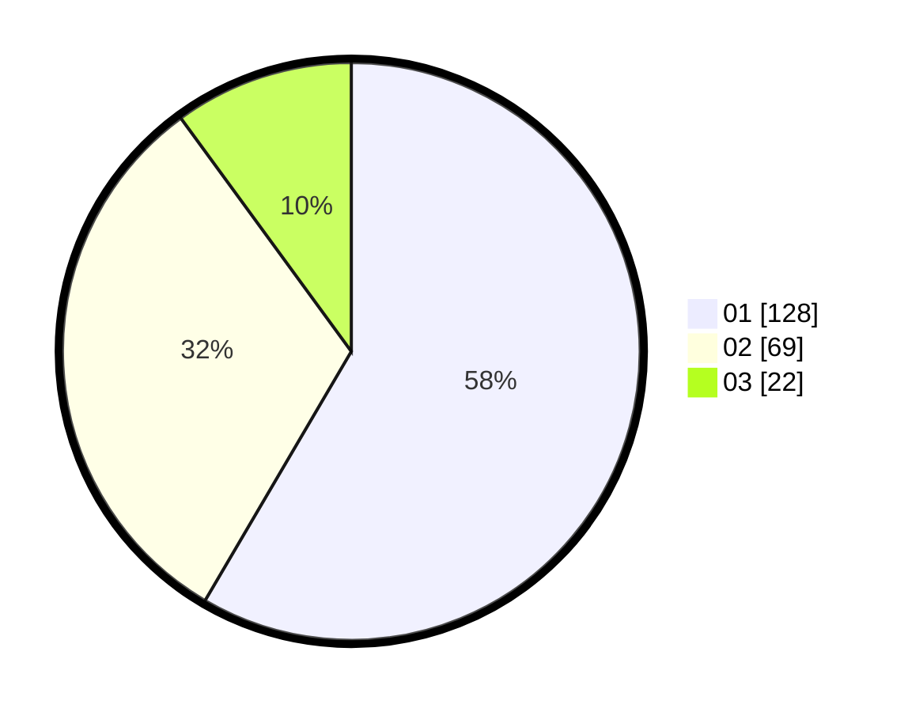

# Hasil

Hasil perolehan suara paslon dapat dilihat pada file paslon-01.txt, paslon-02.txt, dan paslon-03.txt.

Jika tidak ada, artinya data tersebut belum ada pada SIREKAP.

## Perolehan Suara

 * Paslon 01: **128**.
 * Paslon 02: **69**.
 * Paslon 03: **22**.

## Foto C Plano

https://sirekap-obj-formc.kpu.go.id/1bc4/pemilu/ppwp/31/73/05/10/01/3173051001028-20240215-004658--0f3a4a60-49fa-4973-8361-6f142000f2b2.jpg

https://sirekap-obj-formc.kpu.go.id/1bc4/pemilu/ppwp/31/73/05/10/01/3173051001028-20240215-004756--066920d0-e4dd-4e75-8292-837128e61494.jpg

https://sirekap-obj-formc.kpu.go.id/1bc4/pemilu/ppwp/31/73/05/10/01/3173051001028-20240215-004903--3f1f2e83-8e73-4c81-bbd6-dc72faf19509.jpg
