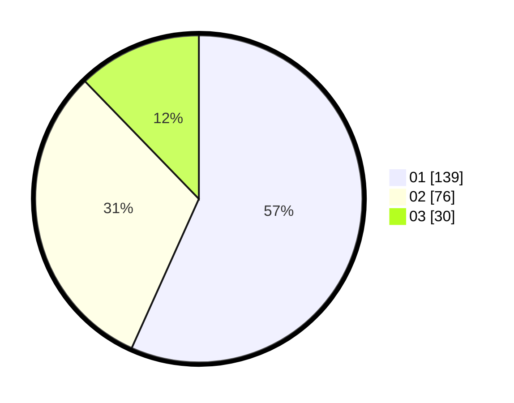

# Hasil

Hasil perolehan suara paslon dapat dilihat pada file paslon-01.txt, paslon-02.txt, dan paslon-03.txt.

Jika tidak ada, artinya data tersebut belum ada pada SIREKAP.

## Perolehan Suara

 * Paslon 01: **139**.
 * Paslon 02: **76**.
 * Paslon 03: **30**.

## Foto C Plano

https://sirekap-obj-formc.kpu.go.id/721f/pemilu/ppwp/31/73/05/10/01/3173051001029-20240216-171757--5bbde69d-6956-486c-81ad-98994f6907ef.jpg

https://sirekap-obj-formc.kpu.go.id/721f/pemilu/ppwp/31/73/05/10/01/3173051001029-20240216-171607--e35c5d06-51cb-4ab3-b166-6b566414bcd2.jpg

https://sirekap-obj-formc.kpu.go.id/721f/pemilu/ppwp/31/73/05/10/01/3173051001029-20240214-232223--8d231f0a-fec9-469d-a786-44cca3352914.jpg
