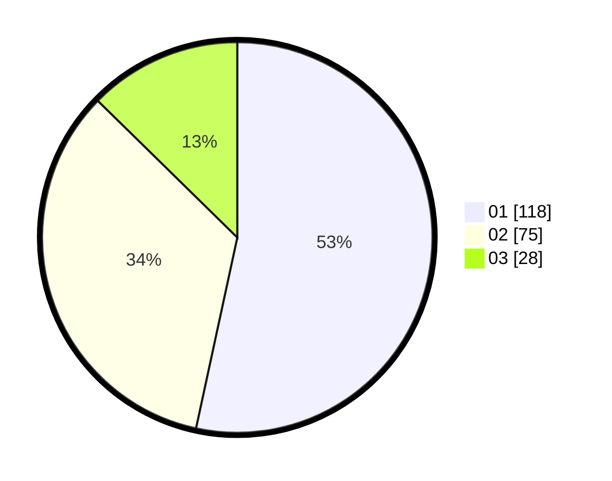

# Hasil

Hasil perolehan suara paslon dapat dilihat pada file paslon-01.txt, paslon-02.txt, dan paslon-03.txt.

Jika tidak ada, artinya data tersebut belum ada pada SIREKAP.

## Perolehan Suara

 * Paslon 01: **118**.
 * Paslon 02: **75**.
 * Paslon 03: **28**.

## Foto C Plano

https://sirekap-obj-formc.kpu.go.id/bde5/pemilu/ppwp/31/73/05/10/01/3173051001031-20240214-201348--fc6cee5e-6eba-4224-a4ff-32bdb3f2cd0d.jpg

https://sirekap-obj-formc.kpu.go.id/bde5/pemilu/ppwp/31/73/05/10/01/3173051001031-20240214-201439--f7aa895a-bb39-4892-b33c-faecbe3b1df5.jpg

https://sirekap-obj-formc.kpu.go.id/bde5/pemilu/ppwp/31/73/05/10/01/3173051001031-20240214-201527--457e0220-1191-469f-b982-e2578f712a63.jpg

## DATA PEMILIH TETAP

Jumlah pemilih dalam DPT: **276**.
 * L: **133**.
 * P: **143**.

## DATA PENGGUNA HAK PILIH

Jumlah pengguna hak pilih dalam DPT: **204**.
 * L: **95**.
 * P: **109**.

Jumlah pengguna hak pilih dalam DPTb: **17**.
 * L: **4**.
 * P: **13**.

Jumlah pengguna hak pilih dalam DPK: **1**.
 * L: **0**.
 * P: **1**.

Jumlah pengguna hak pilih: **222**.
 * L: **99**.
 * P: **123**.

## JUMLAH SUARA SAH DAN TIDAK SAH

JUMLAH SELURUH SUARA SAH: **221**.

JUMLAH SUARA TIDAK SAH: **1**.

JUMLAH SELURUH SUARA SAH DAN SUARA TIDAK SAH: **222**.
