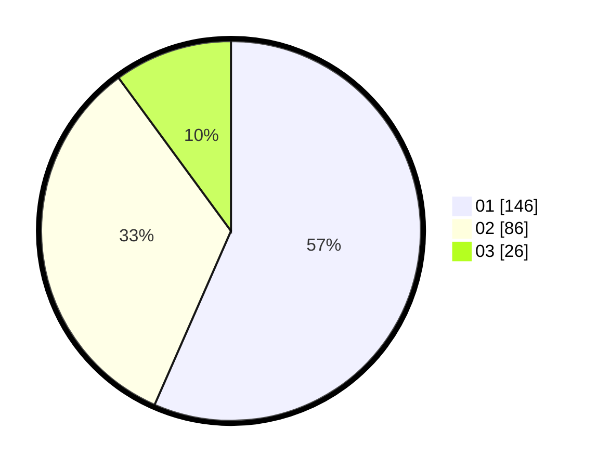

# Hasil

Hasil perolehan suara paslon dapat dilihat pada file paslon-01.txt, paslon-02.txt, dan paslon-03.txt.

Jika tidak ada, artinya data tersebut belum ada pada SIREKAP.

## Perolehan Suara

 * Paslon 01: **146**.
 * Paslon 02: **86**.
 * Paslon 03: **26**.

## Foto C Plano

https://sirekap-obj-formc.kpu.go.id/b781/pemilu/ppwp/31/73/05/10/01/3173051001037-20240214-202912--192cd10b-1b64-4eeb-9491-debd783e9d6a.jpg

https://sirekap-obj-formc.kpu.go.id/b781/pemilu/ppwp/31/73/05/10/01/3173051001037-20240214-224408--d64eae4d-6718-4bff-bf1c-814bea1875d6.jpg

https://sirekap-obj-formc.kpu.go.id/b781/pemilu/ppwp/31/73/05/10/01/3173051001037-20240214-184645--80a0c0d1-2676-43f0-a423-6b0c7079d0cb.jpg

## DATA PEMILIH TETAP

Jumlah pemilih dalam DPT: **294**.
 * L: **165**.
 * P: **129**.

## DATA PENGGUNA HAK PILIH

Jumlah pengguna hak pilih dalam DPT: **258**.
 * L: **144**.
 * P: **114**.

Jumlah pengguna hak pilih dalam DPTb: **1**.
 * L: **0**.
 * P: **1**.

Jumlah pengguna hak pilih dalam DPK: **1**.
 * L: **0**.
 * P: **1**.

Jumlah pengguna hak pilih: **260**.
 * L: **144**.
 * P: **116**.

## JUMLAH SUARA SAH DAN TIDAK SAH

JUMLAH SELURUH SUARA SAH: **258**.

JUMLAH SUARA TIDAK SAH: **2**.

JUMLAH SELURUH SUARA SAH DAN SUARA TIDAK SAH: **260**.
