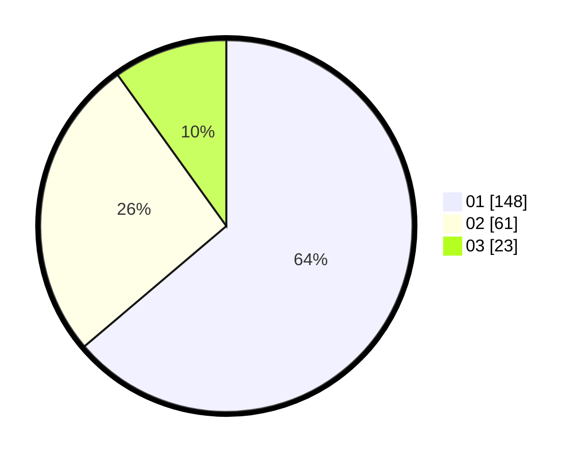

# Hasil

Hasil perolehan suara paslon dapat dilihat pada file paslon-01.txt, paslon-02.txt, dan paslon-03.txt.

Jika tidak ada, artinya data tersebut belum ada pada SIREKAP.

## Perolehan Suara

 * Paslon 01: **148**.
 * Paslon 02: **61**.
 * Paslon 03: **23**.

## Foto C Plano

https://sirekap-obj-formc.kpu.go.id/24ea/pemilu/ppwp/31/73/05/10/01/3173051001038-20240215-003820--88438478-6528-496d-a0fa-a41fb74b7966.jpg

https://sirekap-obj-formc.kpu.go.id/24ea/pemilu/ppwp/31/73/05/10/01/3173051001038-20240215-004151--b69446de-341c-487c-975b-a13c5adf0ec7.jpg

https://sirekap-obj-formc.kpu.go.id/24ea/pemilu/ppwp/31/73/05/10/01/3173051001038-20240214-235020--bd5814ad-698c-4ba7-83ff-e1f9738c5880.jpg
