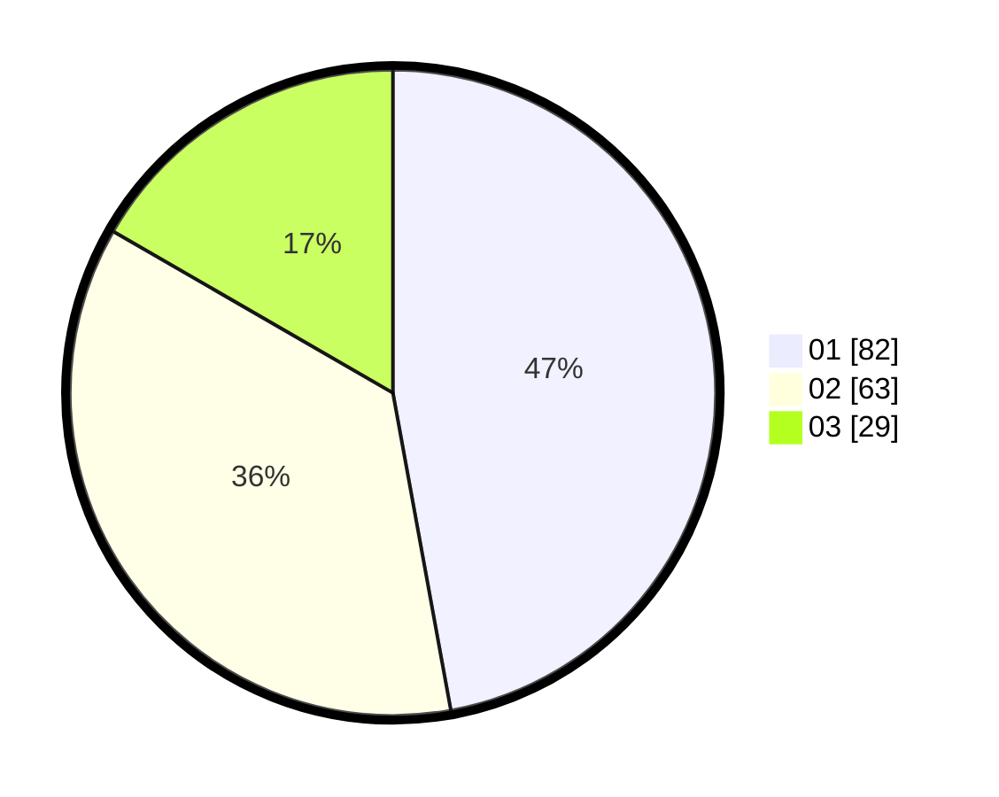

# Hasil

Hasil perolehan suara paslon dapat dilihat pada file paslon-01.txt, paslon-02.txt, dan paslon-03.txt.

Jika tidak ada, artinya data tersebut belum ada pada SIREKAP.

## Perolehan Suara

 * Paslon 01: **82**.
 * Paslon 02: **63**.
 * Paslon 03: **29**.

## Foto C Plano

https://sirekap-obj-formc.kpu.go.id/651e/pemilu/ppwp/31/73/05/10/01/3173051001043-20240214-224654--0befe33f-bf29-4176-95ee-80388aa6cd8f.jpg

https://sirekap-obj-formc.kpu.go.id/651e/pemilu/ppwp/31/73/05/10/01/3173051001043-20240214-225312--5c4c1d9d-7740-484d-9e3e-fba38958a03b.jpg

https://sirekap-obj-formc.kpu.go.id/651e/pemilu/ppwp/31/73/05/10/01/3173051001043-20240214-225458--41e16bd9-4600-4761-a0a7-51d0d658a69b.jpg
