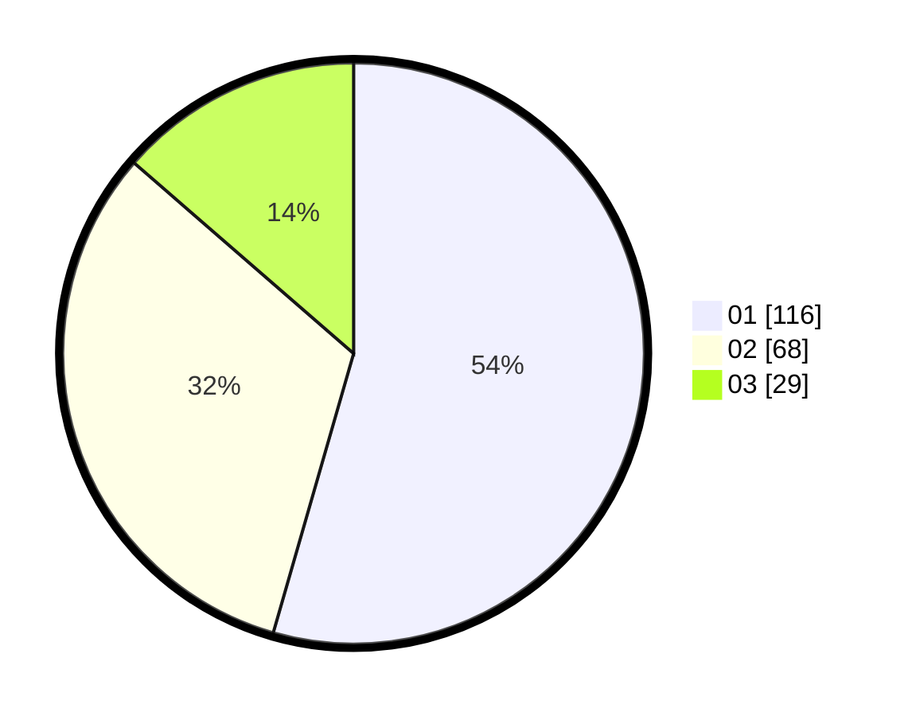

# Hasil

Hasil perolehan suara paslon dapat dilihat pada file paslon-01.txt, paslon-02.txt, dan paslon-03.txt.

Jika tidak ada, artinya data tersebut belum ada pada SIREKAP.

## Perolehan Suara

 * Paslon 01: **116**.
 * Paslon 02: **68**.
 * Paslon 03: **29**.

## Foto C Plano

https://sirekap-obj-formc.kpu.go.id/dd75/pemilu/ppwp/31/73/05/10/01/3173051001047-20240215-000105--52d77b9b-2d18-4059-a12a-9fa9f2bf56ab.jpg

https://sirekap-obj-formc.kpu.go.id/dd75/pemilu/ppwp/31/73/05/10/01/3173051001047-20240214-233833--60a83ab1-b355-4669-a1b4-089e7a0eb053.jpg

https://sirekap-obj-formc.kpu.go.id/dd75/pemilu/ppwp/31/73/05/10/01/3173051001047-20240214-233906--d2766b8b-21f6-4d82-9872-6d80c95116ae.jpg
