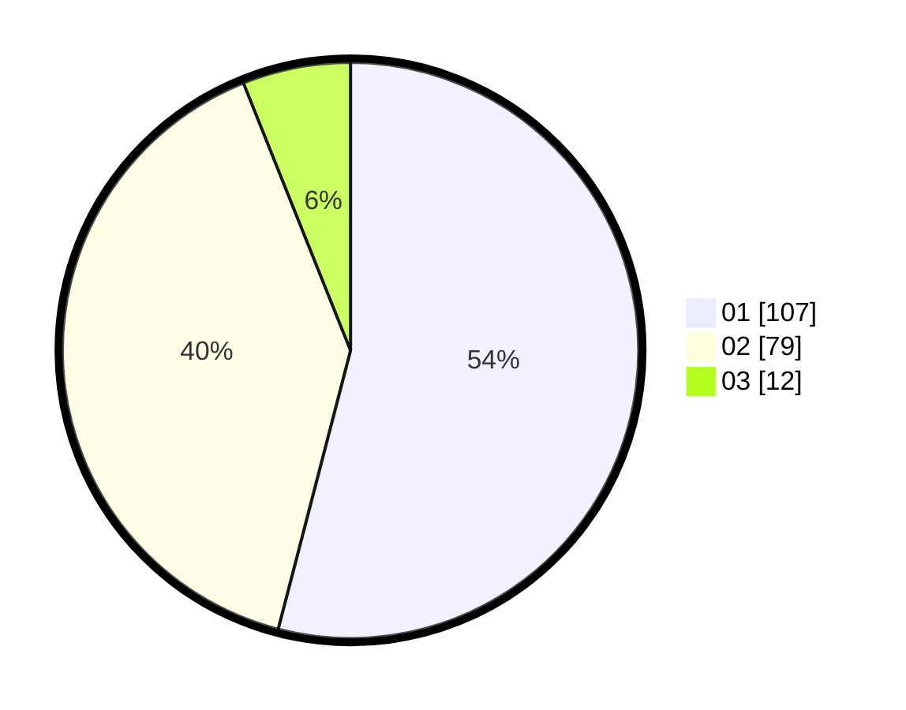

# Hasil

Hasil perolehan suara paslon dapat dilihat pada file paslon-01.txt, paslon-02.txt, dan paslon-03.txt.

Jika tidak ada, artinya data tersebut belum ada pada SIREKAP.

## Perolehan Suara

 * Paslon 01: **107**.
 * Paslon 02: **79**.
 * Paslon 03: **12**.

## Foto C Plano

https://sirekap-obj-formc.kpu.go.id/170e/pemilu/ppwp/31/73/05/10/01/3173051001048-20240214-202857--eed1122e-ec80-4166-acc1-c38b471700af.jpg

https://sirekap-obj-formc.kpu.go.id/170e/pemilu/ppwp/31/73/05/10/01/3173051001048-20240214-211453--58135378-728d-491d-bd95-a8bcf2aa64d7.jpg

https://sirekap-obj-formc.kpu.go.id/170e/pemilu/ppwp/31/73/05/10/01/3173051001048-20240214-202742--4e603d04-347d-45aa-a0c1-acb3671d4f1f.jpg

## DATA PEMILIH TETAP

Jumlah pemilih dalam DPT: **241**.
 * L: **116**.
 * P: **125**.

## DATA PENGGUNA HAK PILIH

Jumlah pengguna hak pilih dalam DPT: **189**.
 * L: **83**.
 * P: **106**.

Jumlah pengguna hak pilih dalam DPTb: **5**.
 * L: **2**.
 * P: **3**.

Jumlah pengguna hak pilih dalam DPK: **6**.
 * L: **5**.
 * P: **1**.

Jumlah pengguna hak pilih: **200**.
 * L: **90**.
 * P: **110**.

## JUMLAH SUARA SAH DAN TIDAK SAH

JUMLAH SELURUH SUARA SAH: **198**.

JUMLAH SUARA TIDAK SAH: **2**.

JUMLAH SELURUH SUARA SAH DAN SUARA TIDAK SAH: **200**.
