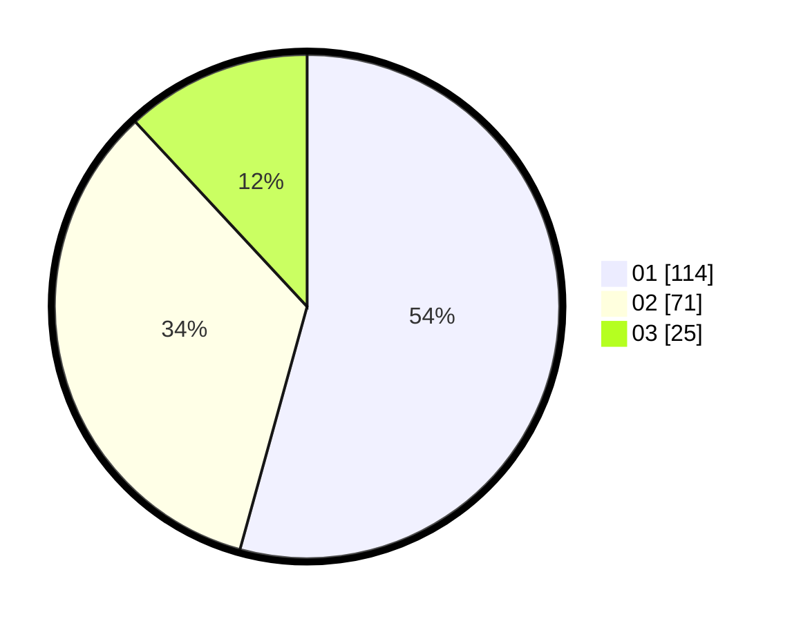

# Hasil

Hasil perolehan suara paslon dapat dilihat pada file paslon-01.txt, paslon-02.txt, dan paslon-03.txt.

Jika tidak ada, artinya data tersebut belum ada pada SIREKAP.

## Perolehan Suara

 * Paslon 01: **114**.
 * Paslon 02: **71**.
 * Paslon 03: **25**.

## Foto C Plano

https://sirekap-obj-formc.kpu.go.id/8b25/pemilu/ppwp/31/73/05/10/01/3173051001050-20240214-224759--e950f63b-693b-4d81-bc11-1c9137deba46.jpg

https://sirekap-obj-formc.kpu.go.id/8b25/pemilu/ppwp/31/73/05/10/01/3173051001050-20240214-224903--da024c25-4763-4e65-b8c9-1ebb6b5aed1c.jpg

https://sirekap-obj-formc.kpu.go.id/8b25/pemilu/ppwp/31/73/05/10/01/3173051001050-20240214-224918--4a3bd6e4-2cec-4a90-a81f-725ec2bf4610.jpg
