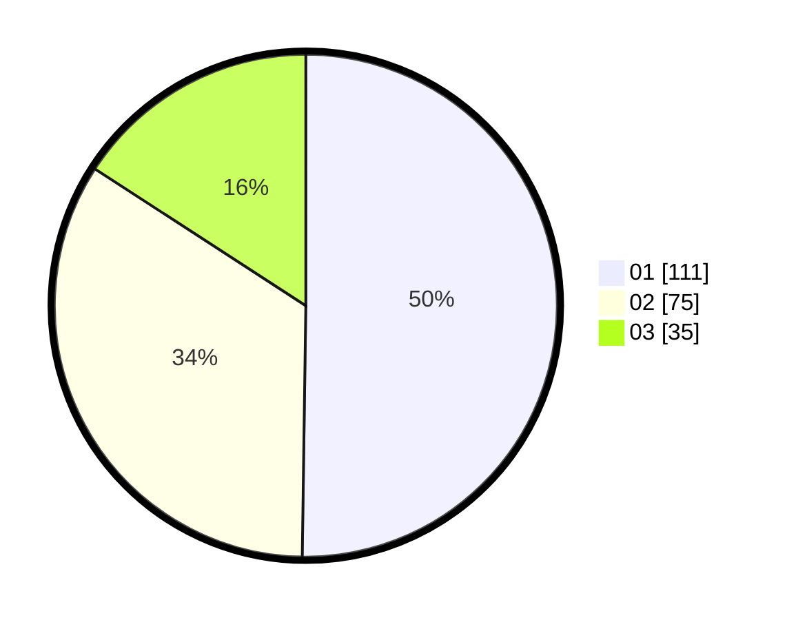

# Hasil

Hasil perolehan suara paslon dapat dilihat pada file paslon-01.txt, paslon-02.txt, dan paslon-03.txt.

Jika tidak ada, artinya data tersebut belum ada pada SIREKAP.

## Perolehan Suara

 * Paslon 01: **111**.
 * Paslon 02: **75**.
 * Paslon 03: **35**.

## Foto C Plano

https://sirekap-obj-formc.kpu.go.id/3a9c/pemilu/ppwp/31/73/05/10/01/3173051001052-20240214-200120--50b067a5-f302-485c-9bec-65f5f68fa51b.jpg

https://sirekap-obj-formc.kpu.go.id/3a9c/pemilu/ppwp/31/73/05/10/01/3173051001052-20240214-204925--7051f453-f1e5-4354-a96f-e5c7266418af.jpg

https://sirekap-obj-formc.kpu.go.id/3a9c/pemilu/ppwp/31/73/05/10/01/3173051001052-20240214-205050--d46bfc8f-e2f7-46c3-99c5-bfe47377391a.jpg

## DATA PEMILIH TETAP

Jumlah pemilih dalam DPT: **281**.
 * L: **133**.
 * P: **148**.

## DATA PENGGUNA HAK PILIH

Jumlah pengguna hak pilih dalam DPT: **220**.
 * L: **102**.
 * P: **118**.

Jumlah pengguna hak pilih dalam DPTb: **0**.
 * L: **0**.
 * P: **0**.

Jumlah pengguna hak pilih dalam DPK: **1**.
 * L: **1**.
 * P: **0**.

Jumlah pengguna hak pilih: **221**.
 * L: **103**.
 * P: **118**.

## JUMLAH SUARA SAH DAN TIDAK SAH

JUMLAH SELURUH SUARA SAH: **221**.

JUMLAH SUARA TIDAK SAH: **0**.

JUMLAH SELURUH SUARA SAH DAN SUARA TIDAK SAH: **221**.
