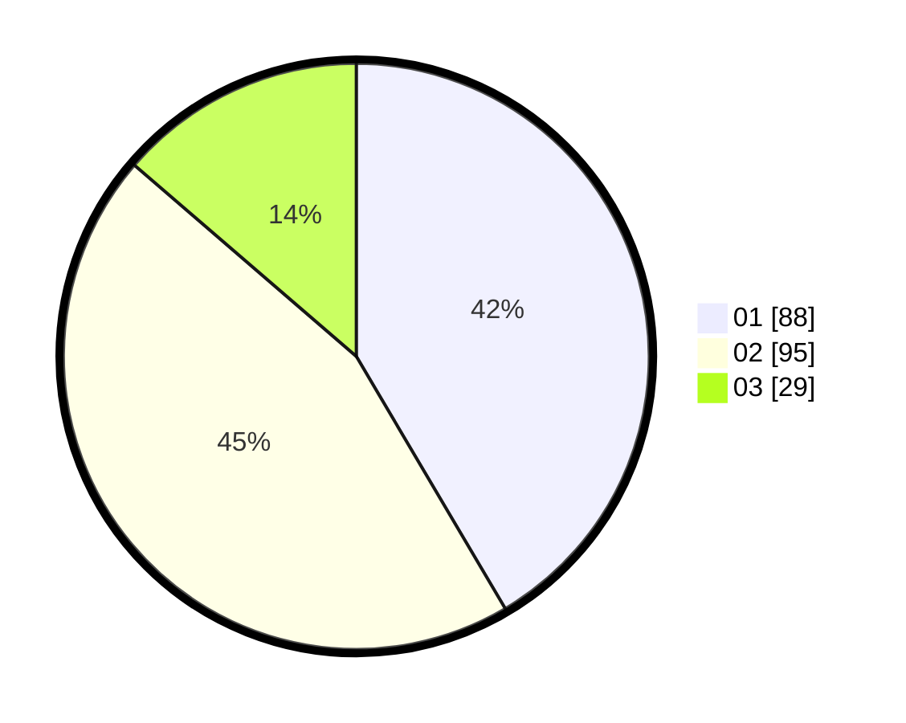

# Hasil

Hasil perolehan suara paslon dapat dilihat pada file paslon-01.txt, paslon-02.txt, dan paslon-03.txt.

Jika tidak ada, artinya data tersebut belum ada pada SIREKAP.

## Perolehan Suara

 * Paslon 01: **88**.
 * Paslon 02: **95**.
 * Paslon 03: **29**.

## Foto C Plano

https://sirekap-obj-formc.kpu.go.id/8bb4/pemilu/ppwp/31/73/05/10/01/3173051001060-20240215-025314--917cb76b-d8a1-4ce2-a7f9-44f749a8eac1.jpg

https://sirekap-obj-formc.kpu.go.id/8bb4/pemilu/ppwp/31/73/05/10/01/3173051001060-20240215-025908--ba01a968-00e0-49cf-bfd3-29578cbb1868.jpg

https://sirekap-obj-formc.kpu.go.id/8bb4/pemilu/ppwp/31/73/05/10/01/3173051001060-20240215-030244--d98d9c6e-de0d-4bcf-b47c-8e3730fca2ea.jpg
