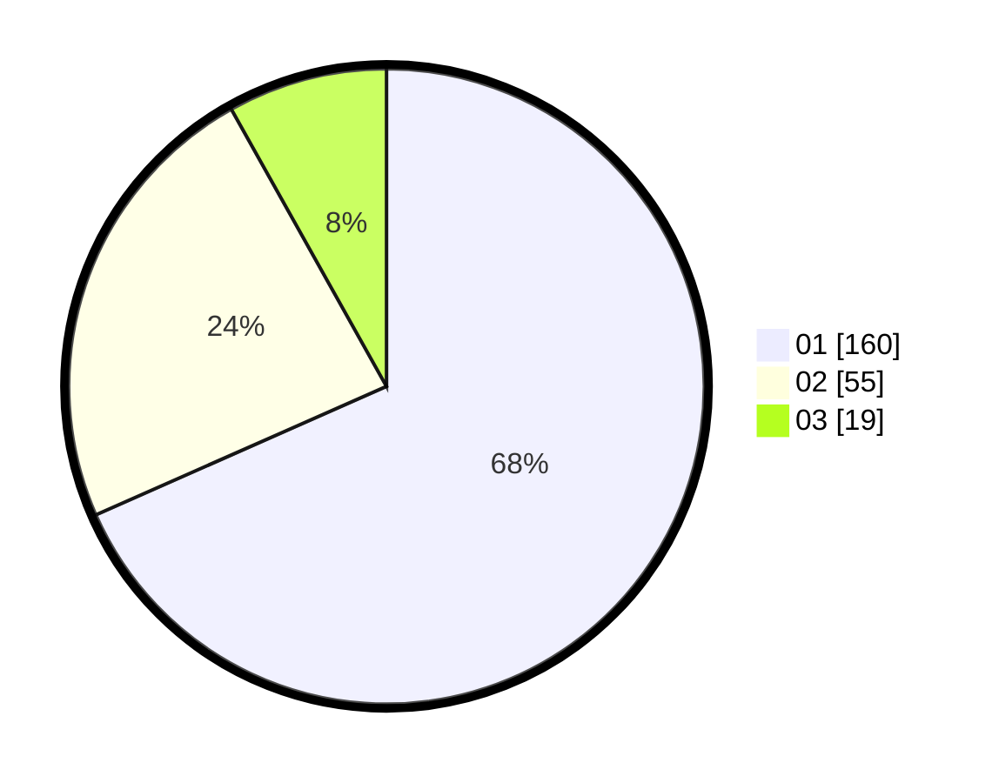

# Hasil

Hasil perolehan suara paslon dapat dilihat pada file paslon-01.txt, paslon-02.txt, dan paslon-03.txt.

Jika tidak ada, artinya data tersebut belum ada pada SIREKAP.

## Perolehan Suara

 * Paslon 01: **160**.
 * Paslon 02: **55**.
 * Paslon 03: **19**.

## Foto C Plano

https://sirekap-obj-formc.kpu.go.id/390a/pemilu/ppwp/31/73/05/10/01/3173051001063-20240214-224311--74017dea-eb90-4dd8-bf25-f4b644e3fd57.jpg

https://sirekap-obj-formc.kpu.go.id/390a/pemilu/ppwp/31/73/05/10/01/3173051001063-20240214-224340--4742e8e2-0735-47bd-9fc4-e124664a571b.jpg

https://sirekap-obj-formc.kpu.go.id/390a/pemilu/ppwp/31/73/05/10/01/3173051001063-20240214-224414--b1385abd-3489-4fe9-88b9-782a5e760314.jpg
