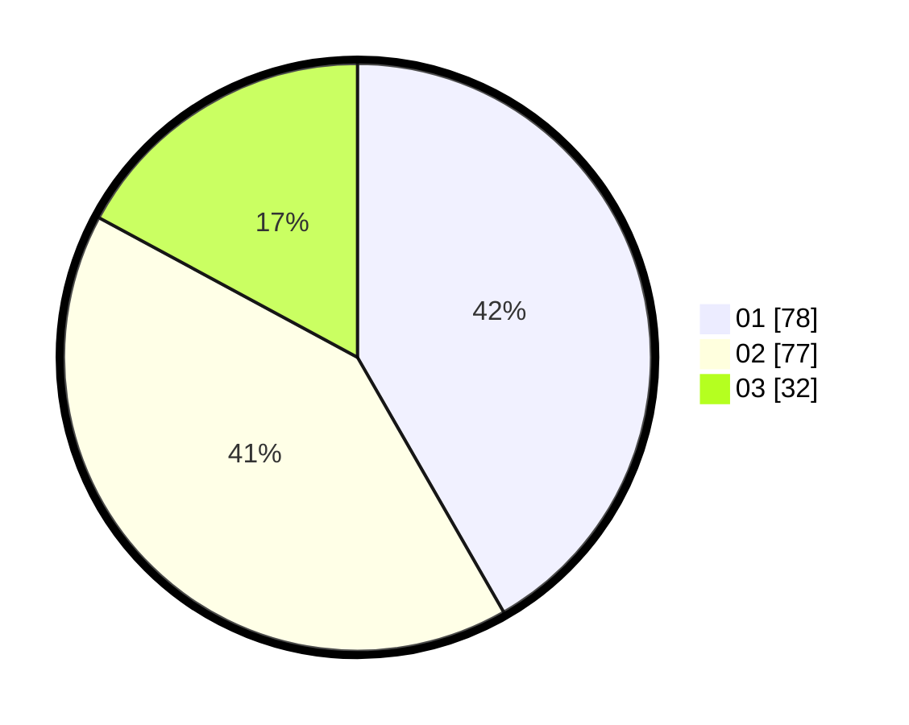

# Hasil

Hasil perolehan suara paslon dapat dilihat pada file paslon-01.txt, paslon-02.txt, dan paslon-03.txt.

Jika tidak ada, artinya data tersebut belum ada pada SIREKAP.

## Perolehan Suara

 * Paslon 01: **78**.
 * Paslon 02: **77**.
 * Paslon 03: **32**.

## Foto C Plano

https://sirekap-obj-formc.kpu.go.id/397d/pemilu/ppwp/31/73/05/10/01/3173051001066-20240215-010341--60cab3a0-419c-4275-9812-e199063371c3.jpg

https://sirekap-obj-formc.kpu.go.id/397d/pemilu/ppwp/31/73/05/10/01/3173051001066-20240215-010438--46602164-51fd-49f5-9942-b4edd6b4e4a9.jpg

https://sirekap-obj-formc.kpu.go.id/397d/pemilu/ppwp/31/73/05/10/01/3173051001066-20240215-010529--2cabba69-293c-4a04-836c-e6621d543b36.jpg
