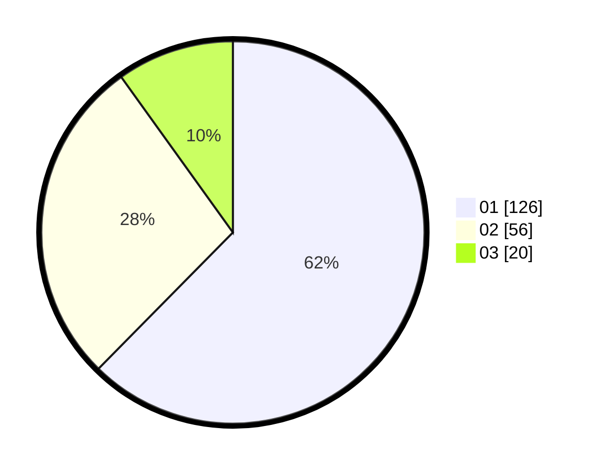

# Hasil

Hasil perolehan suara paslon dapat dilihat pada file paslon-01.txt, paslon-02.txt, dan paslon-03.txt.

Jika tidak ada, artinya data tersebut belum ada pada SIREKAP.

## Perolehan Suara

 * Paslon 01: **126**.
 * Paslon 02: **56**.
 * Paslon 03: **20**.

## Foto C Plano

https://sirekap-obj-formc.kpu.go.id/a98d/pemilu/ppwp/31/73/05/10/01/3173051001069-20240215-030501--037b5208-8fc8-45c6-9feb-3dc07d14f01e.jpg

https://sirekap-obj-formc.kpu.go.id/a98d/pemilu/ppwp/31/73/05/10/01/3173051001069-20240215-030550--0acd1b58-6734-485a-91aa-54671693aaac.jpg

https://sirekap-obj-formc.kpu.go.id/a98d/pemilu/ppwp/31/73/05/10/01/3173051001069-20240215-030642--475f1d1f-94fa-4e27-bbc0-c356331da434.jpg
